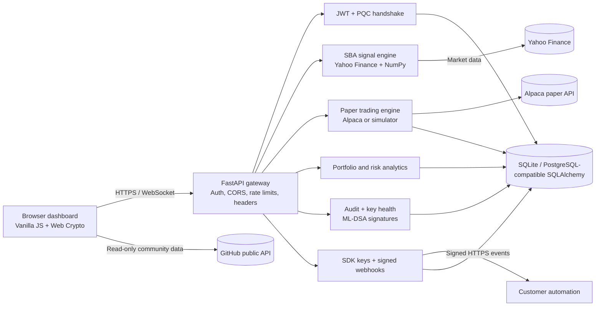
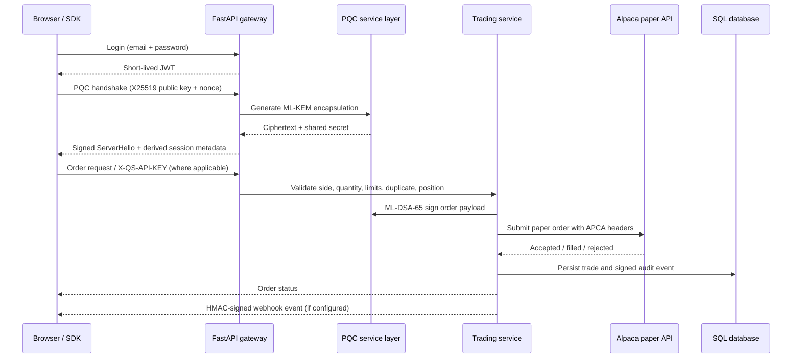
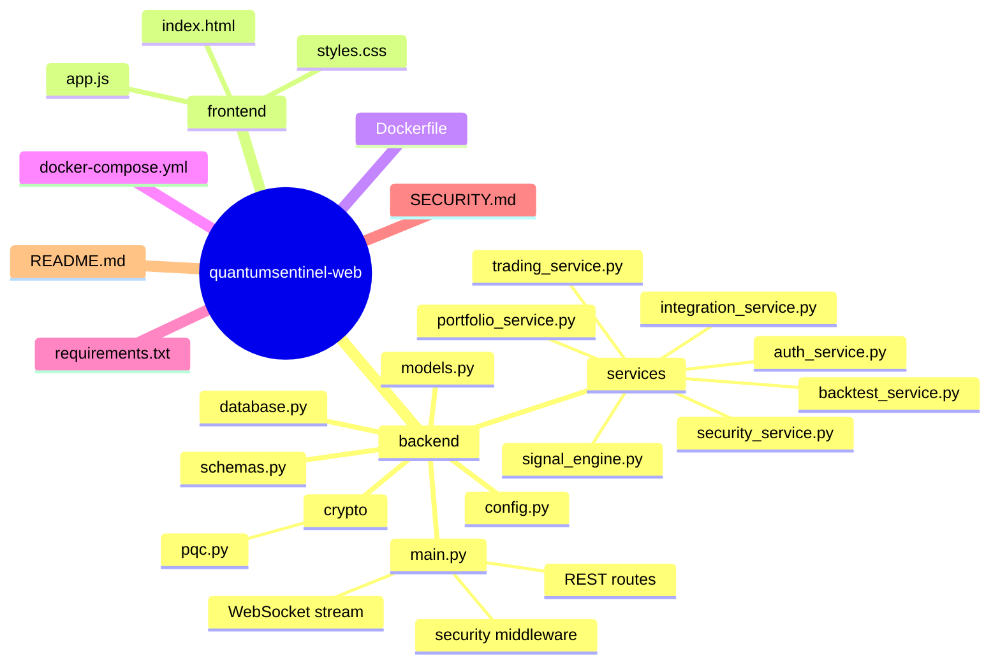

# QuantumSentinel

**A paper-trading terminal for experimenting with post-quantum security, quantum-inspired signals, and auditable execution.**

QuantumSentinel is an open-source reference implementation based on the product requirements and technical architecture documents in this repository. It combines a mobile-friendly dashboard, real market-data signal generation, paper execution, portfolio risk analytics, signed audit evidence, scoped SDK access, and signed webhooks.

> **Safety boundary:** QuantumSentinel is paper-trading software. It is not a live brokerage, custodian, financial adviser, or production-certified cryptographic service. Never connect production financial credentials without completing the hardening steps in [SECURITY.md](SECURITY.md).

## What is implemented

| Product capability | Current implementation |
| --- | --- |
| PQC handshake | X25519 + ML-KEM-768 mixed with HKDF-SHA256; ML-DSA-65 signs the server hello |
| Signed execution | ML-DSA-65 order signatures and signed, re-verified audit entries |
| Signal engine | NumPy SBA implementation with RSI, MACD, momentum, Bollinger width, and market correlations from Yahoo Finance |
| Real-time dashboard | Authenticated WebSocket signal stream with reconnect backoff and polling fallback |
| Paper trading | Alpaca paper API integration or a local market-price simulator |
| Order controls | Market, limit, stop, stop-limit, DAY/GTC/IOC, duplicate blocking, oversell prevention, and concentration limits |
| Strategy workflow | Moving-average strategy builder, persisted strategies, and historical backtests |
| Portfolio | Positions, P&L, equity curve, Sharpe ratio, max drawdown, VaR 95/99, and CSV export |
| Security operations | Key health, rotation, Quantum Safety Score, signed audit log, and compliance evidence export |
| Enterprise SDK | Hashed scoped `X-QS-API-KEY` credentials for read/trade operations |
| Webhooks | Public HTTPS-only endpoints with encrypted-at-rest signing secrets and HMAC event signatures |
| Beginner experience | Five-step onboarding tour, plain-language tips, and a visual community hub |

## Architecture

The checked-in application is intentionally portable: FastAPI, SQLAlchemy, SQLite, and in-process services run as one process. The PRD's distributed Postgres/Redis/Rust/liboqs deployment is the production evolution path, not a claim about this demo's default runtime.



### Secure session and order flow



### Repository structure



## Quick start

```bash
git clone https://github.com/BugHunterX2101/quantumsentinel-web.git
cd quantumsentinel-web
python -m venv .venv
# Windows: .venv\\Scripts\\activate
# macOS/Linux: source .venv/bin/activate
pip install -r requirements.txt
uvicorn backend.main:app --host 127.0.0.1 --port 8000 --reload
```

Open <http://127.0.0.1:8000>, register an account, complete the onboarding tour, and run a paper workflow. Interactive OpenAPI documentation is available at <http://127.0.0.1:8000/docs>.

### Docker

```bash
docker compose up --build
```

The default container uses a persistent SQLite volume for portability. Set `DATABASE_URL` to PostgreSQL for a multi-instance deployment and add a shared Redis implementation for distributed rate limits, sessions, and event delivery.

### Alpaca paper trading

```bash
copy .env.example .env       # Windows
# cp .env.example .env       # macOS/Linux
```

Set `ALPACA_API_KEY`, `ALPACA_SECRET_KEY`, and the paper API base URL. If credentials are absent, the simulator fills marketable orders against the latest market price and keeps the full order lifecycle locally.

## API surface

| Area | Endpoints |
| --- | --- |
| Auth | `POST /api/auth/register`, `POST /api/auth/login`, `POST /api/auth/pqc-handshake` |
| Signals | `GET /api/signals/latest`, `GET /api/signals/refresh`, `WS /api/signals/stream` |
| Trading | `POST/GET /api/trading/orders`, `DELETE /api/trading/orders/{order_id}` |
| Strategies | `GET /api/strategies/templates`, `GET/POST /api/strategies`, `POST/GET /api/backtests` |
| Portfolio | `GET /api/portfolio/positions`, `GET /api/portfolio/risk-metrics`, `GET /api/portfolio/export` |
| Security | `GET /api/security/health`, `GET /api/security/audit-log`, `GET /api/security/compliance-report`, `POST /api/security/rotate-keys` |
| SDK | `GET /api/sdk/portfolio` with `X-QS-API-KEY: <read-key>`, `POST /api/sdk/orders` with a `trade` key |
| Integrations | `/api/integrations/api-keys` and `/api/integrations/webhooks` |

API keys are returned only once at creation. Store them in a secret manager, grant the minimum scope, and revoke them immediately if exposed.

## Configuration

Important variables are documented in [.env.example](.env.example):

- `ENVIRONMENT`, `JWT_PRIVATE_KEY`, `JWT_PUBLIC_KEY`, `CORS_ORIGINS`, and `ALLOWED_HOSTS`
- `DATABASE_URL`
- `WEBHOOK_ENCRYPTION_KEY`, `PRIVATE_KEY_ENCRYPTION_KEY`, and persisted server ML-DSA identity keys
- `ALPACA_API_KEY`, `ALPACA_SECRET_KEY`, and `ALPACA_BASE_URL`

Production mode refuses missing key material and wildcard CORS. Put TLS 1.3, a managed secret store, PostgreSQL, Redis, and a hardened liboqs/HSM-backed PQC service in front of this reference process before handling sensitive workloads.

## Verification

```bash
node --check frontend/app.js
python -m py_compile backend/main.py backend/schemas.py backend/models.py
pytest -q
git diff --check
```

The full Docker startup check requires a running Docker Engine. Market-data and Alpaca integration tests also require network access and credentials where applicable.

## Security and limitations

Read [SECURITY.md](SECURITY.md) before deployment. The bundled pure-Python PQC packages are reference implementations and are not constant-time. The local limiter and audit signing identity are process-local simplifications. This project does not claim FIPS 140-3 validation, legal compliance certification, zero-day immunity, or protection against every possible breach.

## License

Apache-2.0. See [LICENSE](LICENSE).
