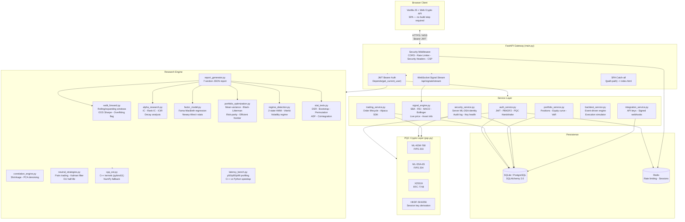
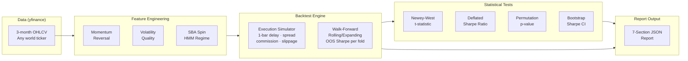
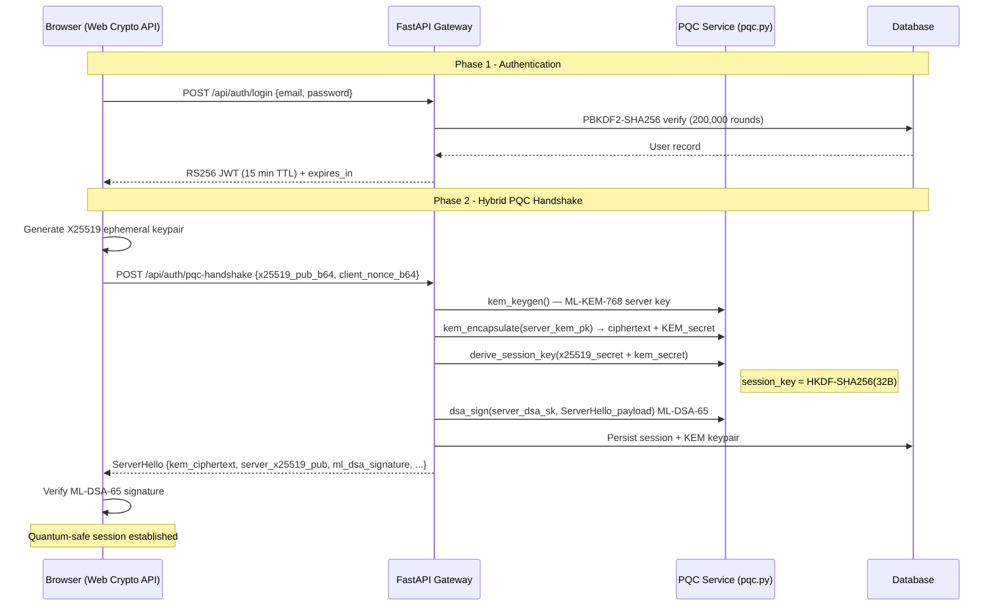
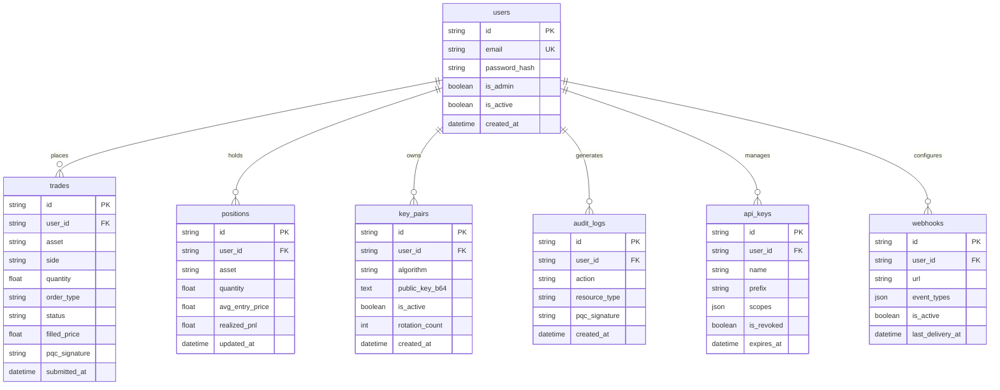

<div align="center">


# QuantumSentinel

### Post-Quantum Secure Trading Terminal · Serious Quant Research Engine

[](https://python.org)
[](https://fastapi.tiangolo.com)
[](tests/)
[](https://csrc.nist.gov/pubs/fips/203/final)
[](https://csrc.nist.gov/pubs/fips/204/final)
[](LICENSE)
[](docker-compose.yml)
[](SECURITY.md)

*Quantum-safe cryptography · Realistic backtesting engine · Walk-forward validation · Factor modeling · C++ accelerated kernels*

</div>

---

> **Safety boundary:** QuantumSentinel is paper-trading and research software. It is not a live brokerage, custodian, financial adviser, or production-certified cryptographic service. Never connect production financial credentials without completing the hardening steps in [SECURITY.md](SECURITY.md).

---

## What Is QuantumSentinel?

QuantumSentinel is a **production-architecture reference implementation** combining two things that rarely appear together:

1. **Post-quantum cryptographic security** — every session uses a hybrid X25519 + ML-KEM-768 handshake (FIPS 203), every order is signed with ML-DSA-65 (FIPS 204), and every audit log entry is tamper-evidenced with a lattice-based signature, verifiable in the browser.

2. **A serious quant research engine** — built to a standard suitable for a systematic-trading desk. The backtester models realistic microstructure (commission, bid-ask spread, slippage, execution delay, partial fills, leverage limits). Walk-forward validation catches in-sample overfitting. Fama-MacBeth cross-sectional regressions measure factor premia. HMM-based regime detection adapts signals to market state. A full statistical test battery (Newey-West, deflated Sharpe ratio, permutation testing) guards against spurious results.

---

## Research Engine — What Makes It Serious

> *"Backtested systematic strategies under realistic transaction-cost and execution assumptions."*

### The full pipeline, end to end:

```
Historical Market Data  (Yahoo Finance OHLCV)
         ↓
Feature Engineering     (momentum, reversal, vol, quality, carry, SBA spin)
         ↓
Signal Generation       (cross-sectional ranking, HMM regime filter)
         ↓
Portfolio Construction  (mean-variance, Black-Litterman, risk-parity, 1/N, min-vol)
         ↓
Execution Simulator     (1-bar delay, partial fills, position sizing, cash constraints)
         ↓
Transaction Costs       (commission model, bid-ask spread, slippage, borrow costs)
         ↓
Portfolio Returns       (equity curve, daily PnL, turnover tracking)
         ↓
Risk / Performance      (Sharpe, Sortino, Calmar, Omega, CVaR 1%/5%, drawdown)
         ↓
Statistical Validation  (Newey-West t-test, DSR, bootstrap CI, permutation p-value)
         ↓
Structured Report       (7-section JSON — executive summary → efficient frontier)
```

---

## Feature Matrix

### Cryptographic Security

| Capability | Implementation | Standard |
|---|---|---|
| **PQC Handshake** | Hybrid X25519 + ML-KEM-768 via HKDF-SHA256 | FIPS 203, RFC 7748 |
| **Order Signing** | ML-DSA-65 signs every order payload | FIPS 204 |
| **Audit Trail** | Server-signed `AuditLog` with in-browser verification | FIPS 204 |
| **Password Hashing** | PBKDF2-SHA256, 200,000 rounds | NIST SP 800-132 |
| **Keys at Rest** | AES-256-GCM (Fernet) encryption for all stored keys | NIST SP 800-38D |
| **JWT Auth** | RS256, 15-min TTL, nonce replay protection | RFC 7518 |

### Quant Research (Phases 1–4)

| Module | Capability |
|---|---|
| **Backtest Engine** | Event-driven loop, commission + spread + slippage, 1-bar execution delay, leverage limits, short selling, partial fills, borrow costs |
| **Walk-Forward Validation** | Rolling & expanding window, per-fold OOS Sharpe, parameter optimisation per fold, overfitting detection, degradation flag |
| **Alpha Research** | IC, Rank IC, ICIR, hit rate, decay analysis (1–20 bar horizon), quintile/decile returns, signal turnover |
| **Fama-MacBeth Factor Model** | Cross-sectional regression, Newey-West adjusted t-statistics, factor premia per asset, per-period R² |
| **Correlation Engine** | Sample, shrinkage (Ledoit-Wolf), PCA denoising, shrinkage intensity optimisation, rolling 252-day window |
| **Portfolio Optimisation** | Mean-variance (Markowitz), Black-Litterman, Risk-Parity, Min-Vol, Equal-Weight; efficient frontier |
| **HMM Regime Detection** | 2-state Gaussian HMM (bull/bear), Viterbi decoding, volatility regime, trend regime, transition matrix |
| **Statistical Testing** | Newey-West t-test, Deflated Sharpe Ratio (DSR), block bootstrap CI, permutation p-value, Ljung-Box autocorrelation, ADF unit-root, Durbin-Watson, cointegration |
| **Stat Arb / Pairs** | Engle-Granger cointegration, Kalman filter hedge ratio, z-score signal, Ornstein-Uhlenbeck half-life |
| **C++ Kernels** | pybind11 extension: `rolling_corr` (T,N,N), `hmm_forward` (scaled forward algorithm), `backtest_loop` — with transparent NumPy fallback |
| **p50/p99 Latency Profiler** | `TimerStats` dataclass, per-stage repeated runs, p50/p95/p99/p99.9 percentiles, C++ vs Python speedup benchmark |
| **Research Report Generator** | 7-section structured JSON: executive summary, walk-forward table, factor premia table, regime statistics, statistical validation, risk decomposition, efficient frontier |

### Trading Terminal

| Capability | Details |
|---|---|
| **Signal Engine** | SBA + RSI-14 + MACD 12/26/9 + 20-day momentum + Bollinger width + AI insight text |
| **Live Price API** | Always-fresh 5s micro-cached yfinance price for any world ticker |
| **Asset Info** | Instrument type, exchange, market-open status, trading features |
| **Global Markets** | 9 exchanges (NYSE, NSE/BSE, LSE, Xetra, TSE, HKEX, ASX, TSX, Crypto) |
| **Paper Trading** | Alpaca paper API integration + local market-price fallback simulator |
| **Order Controls** | Market/Limit/Stop/Stop-Limit, Day/GTC/IOC, duplicate guard, oversell prevention |
| **Portfolio Risk** | Positions, unrealised + realised P&L, equity curve, Sharpe, VaR 95/99, CSV export |
| **Enterprise SDK** | Scoped `X-QS-API-KEY` credentials (read / trade / admin) |
| **Signed Webhooks** | HTTPS-only, HMAC-SHA256 signed, Fernet-encrypted secrets at rest |
| **Prometheus Metrics** | HTTP request counts, latency histograms, behind auth guard |

---

## System Architecture

### High-Level Component Map


```mermaid
flowchart TB
    subgraph Client["Browser Client"]
        FE["Vanilla JS + Web Crypto API<br/>SPA — no build step required"]
    end

    subgraph Gateway["FastAPI Gateway (main.py)"]
        MW["Security Middleware<br/>CORS - Rate Limiter - Security Headers - CSP"]
        AUTH_MW["JWT Bearer Auth<br/>Depends(get_current_user)"]
        WS["WebSocket Signal Stream<br/>/api/signals/stream"]
        SPA["SPA Catch-all<br/>/{path:path} -> index.html"]
    end

    subgraph Services["Service Layer"]
        AUTH["auth_service.py<br/>JWT - PBKDF2 - PQC Handshake"]
        SIG["signal_engine.py<br/>SBA - RSI - MACD - Bollinger<br/>Live price - Asset info"]
        TRADE["trading_service.py<br/>Order lifecycle - Alpaca SDK"]
        PORT["portfolio_service.py<br/>Positions - Equity curve - VaR"]
        SEC["security_service.py<br/>Server ML-DSA identity<br/>Audit log - Key health"]
        BACK["backtest_service.py<br/>Event-driven engine<br/>Execution simulator"]
        INTG["integration_service.py<br/>API keys - Signed webhooks"]
    end

    subgraph Research["Research Engine"]
        WF["walk_forward.py<br/>Rolling/expanding windows<br/>OOS Sharpe - Overfitting flag"]
        ALPHA["alpha_research.py<br/>IC - Rank IC - ICIR<br/>Decay analysis"]
        FACTOR["factor_model.py<br/>Fama-MacBeth regression<br/>Newey-West t-stats"]
        CORR["correlation_engine.py<br/>Shrinkage - PCA denoising"]
        OPT["portfolio_optimization.py<br/>Mean-variance - Black-Litterman<br/>Risk-parity - Efficient frontier"]
        REGIME["regime_detection.py<br/>2-state HMM - Viterbi<br/>Volatility regime"]
        STAT["stat_tests.py<br/>DSR - Bootstrap - Permutation<br/>ADF - Cointegration"]
        NEUTRAL["neutral_strategies.py<br/>Pairs trading - Kalman filter<br/>OU half-life"]
        REPORT["report_generator.py<br/>7-section JSON report"]
        CPP["cpp_ext.py<br/>C++ kernels (pybind11)<br/>NumPy fallback"]
        BENCH["latency_bench.py<br/>p50/p95/p99 profiling<br/>C++ vs Python speedup"]
    end

    subgraph Crypto["PQC Crypto Layer (pqc.py)"]
        KEM["ML-KEM-768<br/>FIPS 203"]
        DSA["ML-DSA-65<br/>FIPS 204"]
        X25519["X25519<br/>RFC 7748"]
        HKDF["HKDF-SHA256<br/>Session key derivation"]
    end

    subgraph Persistence["Persistence"]
        DB[("SQLite / PostgreSQL<br/>SQLAlchemy 2.0")]
        REDIS[("Redis<br/>Rate limiting - Sessions")]
    end

    Client <-->|"HTTPS / WSS<br/>Bearer JWT"| Gateway
    Gateway --> AUTH_MW --> Services
    Gateway --> AUTH_MW --> Research
    Gateway --> WS --> SIG
    AUTH --> Crypto
    SEC --> Crypto
    TRADE --> Crypto
    AUTH --> DB
    TRADE --> DB
    PORT --> DB
    SEC --> DB
    INTG --> DB
    AUTH --> REDIS
    MW --> REDIS
    Research --> CPP
    REPORT --> WF & ALPHA & FACTOR & REGIME & STAT & OPT
```

---

### Research Pipeline Data Flow


```mermaid
flowchart LR
    subgraph Input["Data (yfinance)"]
        YF["3-month OHLCV<br/>Any world ticker"]
    end

    subgraph FE["Feature Engineering"]
        MOM["Momentum<br/>Reversal"]
        VOL["Volatility<br/>Quality"]
        SBA["SBA Spin<br/>HMM Regime"]
    end

    subgraph Backtest["Backtest Engine"]
        EXEC["Execution Simulator<br/>1-bar delay · spread<br/>commission · slippage"]
        WF["Walk-Forward<br/>Rolling/Expanding<br/>OOS Sharpe per fold"]
    end

    subgraph Stats["Statistical Tests"]
        NW["Newey-West<br/>t-statistic"]
        DSR["Deflated<br/>Sharpe Ratio"]
        PERM["Permutation<br/>p-value"]
        BS["Bootstrap<br/>Sharpe CI"]
    end

    subgraph Output["Report Output"]
        RPT["7-Section JSON<br/>Report"]
    end

    YF --> FE --> Backtest --> Stats --> Output
    Backtest --> Output
```

---

### PQC Hybrid Handshake Protocol


```mermaid
sequenceDiagram
    participant BR as Browser (Web Crypto API)
    participant GW as FastAPI Gateway
    participant PQC as PQC Service (pqc.py)
    participant DB as Database

    Note over BR,DB: Phase 1 - Authentication
    BR->>GW: POST /api/auth/login {email, password}
    GW->>DB: PBKDF2-SHA256 verify (200,000 rounds)
    DB-->>GW: User record
    GW-->>BR: RS256 JWT (15 min TTL) + expires_in

    Note over BR,DB: Phase 2 - Hybrid PQC Handshake
    BR->>BR: Generate X25519 ephemeral keypair
    BR->>GW: POST /api/auth/pqc-handshake {x25519_pub_b64, client_nonce_b64}
    GW->>PQC: kem_keygen() — ML-KEM-768 server key
    GW->>PQC: kem_encapsulate(server_kem_pk) → ciphertext + KEM_secret
    GW->>PQC: derive_session_key(x25519_secret + kem_secret)
    Note right of PQC: session_key = HKDF-SHA256(32B)
    GW->>PQC: dsa_sign(server_dsa_sk, ServerHello_payload) ML-DSA-65
    GW->>DB: Persist session + KEM keypair
    GW-->>BR: ServerHello {kem_ciphertext, server_x25519_pub, ml_dsa_signature, ...}
    BR->>BR: Verify ML-DSA-65 signature
    Note over BR: Quantum-safe session established
```

---

### Database Schema


```mermaid
erDiagram
    users {
        string id PK
        string email UK
        string password_hash
        boolean is_admin
        boolean is_active
        datetime created_at
    }
    trades {
        string id PK
        string user_id FK
        string asset
        string side
        float quantity
        string order_type
        string status
        float filled_price
        string pqc_signature
        datetime submitted_at
    }
    positions {
        string id PK
        string user_id FK
        string asset
        float quantity
        float avg_entry_price
        float realized_pnl
        datetime updated_at
    }
    key_pairs {
        string id PK
        string user_id FK
        string algorithm
        text public_key_b64
        boolean is_active
        int rotation_count
        datetime created_at
    }
    audit_logs {
        string id PK
        string user_id FK
        string action
        string resource_type
        string pqc_signature
        datetime created_at
    }
    api_keys {
        string id PK
        string user_id FK
        string name
        string prefix
        json scopes
        boolean is_revoked
        datetime expires_at
    }
    webhooks {
        string id PK
        string user_id FK
        string url
        json event_types
        boolean is_active
        datetime last_delivery_at
    }

    users ||--o{ trades : "places"
    users ||--o{ positions : "holds"
    users ||--o{ key_pairs : "owns"
    users ||--o{ audit_logs : "generates"
    users ||--o{ api_keys : "manages"
    users ||--o{ webhooks : "configures"
```

---

## Repository Structure

```
quantumsentinel-web/
│
├── backend/                             # FastAPI application
│   ├── main.py                          # Central router, middleware, WS stream, SPA fallback
│   ├── models.py                        # SQLAlchemy 2.0 declarative schema (8 tables)
│   ├── schemas.py                       # Pydantic v2 request/response validation
│   ├── database.py                      # Engine, session factory, init_db()
│   ├── config.py                        # ENV-driven config with production safety constraints
│   │
│   ├── crypto/
│   │   └── pqc.py                       # ML-KEM-768, ML-DSA-65, X25519, HKDF
│   │
│   └── services/
│       ├── auth_service.py              # JWT, PBKDF2, PQC handshake, nonce TTL
│       ├── signal_engine.py             # SBA, RSI, MACD, live price, asset info
│       ├── trading_service.py           # Order lifecycle, Alpaca SDK, simulator
│       ├── portfolio_service.py         # Positions, equity curve, Sharpe, VaR
│       ├── security_service.py          # Server ML-DSA identity, audit log
│       ├── integration_service.py       # Scoped API keys, signed webhooks
│       │
│       │  ── Research Engine ──
│       ├── backtest_service.py          # Event-driven backtest + execution simulator
│       ├── execution_model.py           # Commission, spread, slippage, borrow cost models
│       ├── walk_forward.py              # Rolling/expanding walk-forward validation
│       ├── alpha_research.py            # IC, Rank IC, ICIR, decay analysis, quintile returns
│       ├── factor_model.py              # Fama-MacBeth cross-sectional regression
│       ├── correlation_engine.py        # Shrinkage (Ledoit-Wolf), PCA denoising
│       ├── portfolio_optimization.py    # Mean-variance, Black-Litterman, Risk-Parity
│       ├── regime_detection.py          # 2-state HMM, Viterbi, vol/trend regime
│       ├── stat_tests.py                # Newey-West, DSR, bootstrap, permutation, ADF
│       ├── neutral_strategies.py        # Pairs trading, Kalman filter, OU half-life
│       ├── report_generator.py          # 7-section structured JSON research report
│       ├── cpp_ext.py                   # C++ kernel wrapper with NumPy fallback
│       └── latency_bench.py             # p50/p95/p99 pipeline latency profiler
│
├── cpp/                                 # C++ performance kernels (pybind11)
│   ├── qs_fast.cpp                      # rolling_corr, hmm_forward, backtest_loop
│   ├── setup.py                         # Cross-platform build (MinGW/MSVC/Linux)
│   └── _qs_fast.cp313-win_amd64.pyd    # Pre-built Windows extension (Python 3.13)
│
├── frontend/                            # Vanilla JS SPA (no build step)
│   ├── index.html                       # App shell, 7-tab navigation, all forms
│   ├── app.js                           # ~2100-line SPA: auth, trading, portfolio, WS
│   ├── bg3d.js                          # Three.js 3D particle background engine
│   ├── styles.css                       # Glassmorphism, animations, mobile-first
│   └── favicon.ico                      # Quantum diamond icon
│
├── tests/                               # Pytest suite — 241 tests, 100% pass rate
│   ├── test_auth.py                     # Authentication & PQC handshake
│   ├── test_trading.py                  # Order lifecycle
│   ├── test_portfolio.py                # Risk metrics
│   ├── test_backtest.py                 # Execution engine
│   ├── test_research.py                 # Walk-forward, alpha, factor model
│   ├── test_phase3.py                   # Stat tests, regime detection, pairs trading
│   └── test_phase4.py                   # C++ kernels, p50/p99 latency, report generator
│
├── deploy/                              # Production deployment configs
│   ├── nginx.conf                       # TLS 1.3 reverse proxy with HSTS
│   └── tls/                             # Certificate mount point
│
├── .env.example                         # All environment variables documented
├── Dockerfile                           # Multi-stage Python image
├── docker-compose.yml                   # Dev/demo — SQLite, single container
├── docker-compose.production.yml        # Prod — PostgreSQL, Redis, Nginx, Gunicorn
├── requirements.txt                     # Pinned dependencies
├── SECURITY.md                          # Threat model, hardening, responsible disclosure
└── README.md                            # This file
```

---

## Quick Start

### Prerequisites

| Requirement | Version |
|---|---|
| Python | 3.13+ (official CPython from python.org) |
| Git | Any recent version |
| C++ compiler *(optional, for C++ kernels)* | MinGW-W64 GCC 16+ (Windows) / GCC 11+ (Linux) / Clang 14+ (macOS) |

### 1 — Clone & Install

```bash
git clone https://github.com/BugHunterX2101/quantumsentinel-web.git
cd quantumsentinel-web

python -m venv .venv

# Windows
.venv\Scripts\activate

# macOS / Linux
source .venv/bin/activate

pip install -r requirements.txt
```

### 2 — Configure (optional)

```bash
# Windows
copy .env.example .env

# macOS / Linux
cp .env.example .env
```

Set `ALPACA_API_KEY` + `ALPACA_SECRET_KEY` for live paper execution via Alpaca. Without them, orders settle against the latest Yahoo Finance price in the built-in simulator.

### 3 — Run

```bash
uvicorn backend.main:app --host 127.0.0.1 --port 8000 --reload
```

Open **http://127.0.0.1:8000** — register, complete the onboarding tour, and place a paper trade.

Interactive API docs: **http://127.0.0.1:8000/docs**

---

## Building the C++ Extension (Optional)

The C++ kernels (`rolling_corr`, `hmm_forward`, `backtest_loop`) deliver significant speedups for large datasets. Without them, all functionality is preserved via the pure-NumPy fallback.

```bash
# Windows (requires MinGW-W64 GCC — install via winget)
winget install BrechtSanders.WinLibs.POSIX.UCRT

# Install build dependencies
pip install pybind11 setuptools

# Build and install in-place
cd cpp
python setup.py build_ext --inplace --compiler=mingw32

# Verify the extension loaded
python -c "from backend.services.cpp_ext import CPP_AVAILABLE; print('C++ kernels:', CPP_AVAILABLE)"
```

```bash
# Linux / macOS (GCC or Clang auto-detected)
cd cpp
pip install -e .

python -c "from backend.services.cpp_ext import CPP_AVAILABLE; print('C++ kernels:', CPP_AVAILABLE)"
```

Check extension status at runtime via the API:
```
GET /api/research/cpp-status
```

---

## Research Engine API Reference

| Method | Endpoint | Description |
|---|---|---|
| `POST` | `/api/research/backtest` | Event-driven backtest with realistic execution costs |
| `POST` | `/api/research/walk-forward` | Rolling/expanding walk-forward validation |
| `POST` | `/api/research/alpha` | IC, Rank IC, ICIR, decay analysis, quintile returns |
| `POST` | `/api/research/factor-model` | Fama-MacBeth cross-sectional regression |
| `POST` | `/api/research/correlation` | Shrinkage/PCA correlation matrix estimation |
| `POST` | `/api/research/portfolio-optimization` | Mean-variance, Black-Litterman, Risk-Parity |
| `POST` | `/api/research/regime-detection` | 2-state HMM + volatility/trend regime |
| `POST` | `/api/research/stat-tests` | Newey-West, DSR, bootstrap, permutation, ADF |
| `POST` | `/api/research/pairs-trading` | Cointegration, Kalman filter, z-score signal |
| `POST` | `/api/research/sba-backtest` | Quantum-inspired SBA signal backtest |
| **`POST`** | **`/api/research/report`** | **Full 7-section research report (all pipelines)** |
| `POST` | `/api/research/latency-benchmark` | p50/p95/p99 pipeline latency + C++ speedup |
| `GET`  | `/api/research/cpp-status` | C++ extension load status and kernel list |

### Research Report — 7 sections

```json
{
  "executive_summary":    { "sharpe_ratio": 1.42, "max_drawdown": -0.087, "alpha": 0.063 },
  "walk_forward_table":   [ { "fold": 1, "oos_sharpe": 1.21, "degraded": false }, ... ],
  "factor_premia_table":  [ { "factor": "momentum", "t_stat": 3.5, "significant_5pct": true } ],
  "regime_statistics":    { "current_hmm": "bull", "bull_prob_pct": 72.4 },
  "statistical_validation": { "survives_deflation": true, "permutation_significant": true },
  "risk_decomposition":   { "cvar_5pct": -0.019, "sortino_ratio": 1.87, "omega_ratio": 1.43 },
  "efficient_frontier":   [ { "vol": 0.12, "return": 0.09 }, ... ]
}
```

---

## Full API Reference

| Area | Method | Endpoint | Auth | Notes |
|---|---|---|---|---|
| **Auth** | `POST` | `/api/auth/register` | — | PBKDF2-SHA256, 200k rounds |
| | `POST` | `/api/auth/login` | — | Returns RS256 JWT |
| | `POST` | `/api/auth/pqc-handshake` | JWT | Hybrid X25519 + ML-KEM-768 |
| **Signals** | `GET` | `/api/signals/latest` | JWT | 20 preloaded assets, 20s cache |
| | `GET` | `/api/signals/asset/{ticker}` | JWT | Any world ticker, 15s cache |
| | `WS` | `/api/signals/stream` | JWT | Live push, exponential backoff |
| **Live Market** | `GET` | `/api/price/{ticker}` | JWT | Always-fresh, 5s micro-cache |
| | `GET` | `/api/asset/info/{ticker}` | JWT | Type, exchange, market open/closed |
| **Trading** | `POST` | `/api/trading/orders` | JWT | ML-DSA-65 signed order |
| | `GET` | `/api/trading/orders` | JWT | Full order history |
| | `DELETE` | `/api/trading/orders/{id}` | JWT | Cancel pending order |
| **Portfolio** | `GET` | `/api/portfolio/positions` | JWT | Mark-to-market |
| | `GET` | `/api/portfolio/risk-metrics` | JWT | Sharpe, VaR 95/99 |
| | `GET` | `/api/portfolio/export` | JWT | CSV download |
| **Research** | `POST` | `/api/research/backtest` | JWT | Full execution simulator |
| | `POST` | `/api/research/walk-forward` | JWT | OOS validation |
| | `POST` | `/api/research/alpha` | JWT | IC, Rank IC, decay |
| | `POST` | `/api/research/factor-model` | JWT | Fama-MacBeth |
| | `POST` | `/api/research/correlation` | JWT | Shrinkage / PCA |
| | `POST` | `/api/research/portfolio-optimization` | JWT | All methods |
| | `POST` | `/api/research/regime-detection` | JWT | HMM + vol + trend |
| | `POST` | `/api/research/stat-tests` | JWT | DSR + bootstrap + permutation |
| | `POST` | `/api/research/pairs-trading` | JWT | Kalman + cointegration |
| | `POST` | `/api/research/report` | JWT | Full 7-section report |
| | `POST` | `/api/research/latency-benchmark` | JWT | p50/p99 + C++ speedup |
| | `GET`  | `/api/research/cpp-status` | JWT | Extension status |
| **Security** | `GET` | `/api/security/health` | JWT | Key age, rotation status |
| | `GET` | `/api/security/audit-log` | JWT | ML-DSA-65 verified entries |
| | `POST` | `/api/security/rotate-keys` | JWT | New KEM + DSA keypair |
| **SDK** | `GET` | `/api/sdk/portfolio` | `X-QS-API-KEY` | Machine-to-machine |
| | `POST` | `/api/sdk/orders` | `X-QS-API-KEY` | Programmatic orders |
| **Integrations** | `POST` | `/api/integrations/api-keys` | JWT | Scoped credentials |
| | `POST` | `/api/integrations/webhooks` | JWT | HMAC-SHA256 signed |
| **Observability** | `GET` | `/metrics` | JWT | Prometheus counters/histograms |
| | `GET` | `/health/live` | — | Liveness probe |
| | `GET` | `/health/ready` | — | Readiness (DB + Redis) |

---

## Docker

### Development (SQLite)

```bash
docker compose up --build
# Open: http://localhost:8000
```

### Production (PostgreSQL + Redis + Nginx TLS)

```bash
# 1. Generate RSA keypair for JWT RS256
python -c "
from cryptography.hazmat.primitives.asymmetric import rsa
from cryptography.hazmat.primitives import serialization
k = rsa.generate_private_key(65537, 2048)
print('PRIVATE:', k.private_bytes(serialization.Encoding.PEM, serialization.PrivateFormat.TraditionalOpenSSL, serialization.NoEncryption()).decode().replace('\n','\\n'))
print('PUBLIC:', k.public_key().public_bytes(serialization.Encoding.PEM, serialization.PublicFormat.SubjectPublicKeyInfo).decode().replace('\n','\\n'))
"

# 2. Fill production env
cp .env.production.example .env.production

# 3. Put TLS certs at deploy/tls/fullchain.pem and deploy/tls/privkey.pem

# 4. Deploy
docker compose -f docker-compose.production.yml --env-file .env.production up -d --build
```

> [!IMPORTANT]
> Production mode deliberately refuses the bundled pure-Python reference PQC backend.
> Set `PQC_PROVIDER` and `PQC_PROVIDER_URL` only after integrating a reviewed liboqs/HSM adapter.

---

## Security Architecture

### Cryptographic Specifications

| Algorithm | Role | Key sizes | Compliance |
|---|---|---|---|
| **ML-KEM-768** | Key encapsulation (post-quantum) | pk: 1184B, sk: 2400B, ct: 1088B, ss: 32B | FIPS 203 |
| **ML-DSA-65** | Digital signatures (post-quantum) | pk: 1952B, sk: 4032B, sig: 3309B | FIPS 204 |
| **X25519** | Classical hybrid KEM leg | pk: 32B, ss: 32B | RFC 7748 |
| **HKDF-SHA256** | Session key derivation | 32B output | RFC 5869 |
| **RS256 (RSA-2048)** | JWT signing | 2048-bit | RFC 7518 |
| **PBKDF2-SHA256** | Password hashing | 200,000 rounds | NIST SP 800-132 |
| **AES-256-GCM** (Fernet) | Key/secret encryption at rest | 256-bit | NIST SP 800-38D |

### Production Hardening Checklist

- [ ] Generate and persist `JWT_PRIVATE_KEY` / `JWT_PUBLIC_KEY` (RS256)
- [ ] Set and store `SERVER_DSA_PRIVATE_KEY` / `PUBLIC_KEY` (audit log integrity)
- [ ] Configure `WEBHOOK_ENCRYPTION_KEY` and `PRIVATE_KEY_ENCRYPTION_KEY` (Fernet)
- [ ] Replace `reference` PQC backend with liboqs/HSM adapter
- [ ] Enable PostgreSQL with encrypted connections
- [ ] Configure Redis with AUTH password and AOF persistence
- [ ] Set strict `CORS_ORIGINS` and `ALLOWED_HOSTS` (no wildcards)
- [ ] Place TLS 1.3 certificates at `deploy/tls/`
- [ ] Rotate ML-KEM-768 and ML-DSA-65 keys within 90-day policy

Read [SECURITY.md](SECURITY.md) for the full threat model and responsible disclosure policy.

---

## Configuration

All variables are documented in [`.env.example`](.env.example):

| Variable | Required | Description |
|---|---|---|
| `ENVIRONMENT` | No | `development` (default) or `production` |
| `DATABASE_URL` | No | SQLite by default; set Postgres DSN for production |
| `JWT_PRIVATE_KEY` | Prod | RS256 private key (PEM, `\n`-escaped) |
| `JWT_PUBLIC_KEY` | Prod | RS256 public key (PEM, `\n`-escaped) |
| `WEBHOOK_ENCRYPTION_KEY` | Prod | Fernet key for encrypting webhook secrets at rest |
| `PRIVATE_KEY_ENCRYPTION_KEY` | Prod | Fernet key for user ML-DSA private keys in DB |
| `SERVER_DSA_PRIVATE_KEY` | Prod | Persistent ML-DSA-65 server signing key (base64) |
| `SERVER_DSA_PUBLIC_KEY` | Prod | Corresponding public key for audit log verification |
| `PQC_PROVIDER` | Prod | Must be set to non-`reference` value in production |
| `PQC_PROVIDER_URL` | Prod | URL to the external liboqs/HSM PQC adapter |
| `CORS_ORIGINS` | Prod | Comma-separated allowed origins (no wildcards) |
| `ALLOWED_HOSTS` | Prod | Comma-separated allowed hostnames |
| `REDIS_URL` | Prod | Distributed rate limiting and session storage |
| `ALPACA_API_KEY` | No | Alpaca paper trading key |
| `ALPACA_SECRET_KEY` | No | Alpaca paper trading secret |

---

## Cache TTL Reference

| Cache | TTL | Description |
|---|---|---|
| Preloaded signals | 20 s | 20 blue-chip assets computed concurrently at startup |
| On-demand signals | 15 s | Any ticker searched live via the dashboard search bar |
| Live price | 5 s | `/api/price/{ticker}` micro-cache — nearly real-time |
| Asset info | 30 s | Instrument type, exchange, market status, trading features |

---

## Verification

```bash
# Run the full test suite
pytest tests/ -v

# Expected: 241 passed

# Python syntax check all modules
python -m py_compile \
    backend/main.py backend/schemas.py backend/models.py \
    backend/crypto/pqc.py \
    backend/services/auth_service.py \
    backend/services/signal_engine.py \
    backend/services/backtest_service.py \
    backend/services/walk_forward.py \
    backend/services/alpha_research.py \
    backend/services/factor_model.py \
    backend/services/correlation_engine.py \
    backend/services/portfolio_optimization.py \
    backend/services/regime_detection.py \
    backend/services/stat_tests.py \
    backend/services/neutral_strategies.py \
    backend/services/report_generator.py \
    backend/services/cpp_ext.py \
    backend/services/latency_bench.py

# JavaScript syntax check
node --check frontend/app.js

# Verify C++ extension status
python -c "from backend.services.cpp_ext import CPP_AVAILABLE; print('C++ kernels:', CPP_AVAILABLE)"

# Docker health check
docker compose up --build -d
curl http://localhost:8000/health/ready
```

---

## Development Roadmap

| Phase | Status | Highlights |
|---|---|---|
| **Phase 1** — Research Engine | ✅ Complete | Event-driven backtest · execution simulator · commission/spread/slippage |
| **Phase 2** — Walk-Forward & Alpha | ✅ Complete | Rolling/expanding WF · IC/Rank IC/ICIR · decay analysis · quintile returns |
| **Phase 3** — Factor & Statistical | ✅ Complete | Fama-MacBeth · DSR · ADF/cointegration · pairs trading · portfolio optimisation |
| **Phase 4** — Performance & Reporting | ✅ Complete | C++ kernels · p50/p99 latency · 7-section report generator · scipy/statsmodels upgrades |

---

## Contributing

Contributions are welcome. Good first issues are tagged on [GitHub Issues](https://github.com/BugHunterX2101/quantumsentinel-web/issues?q=label%3A%22good+first+issue%22).

```bash
git checkout -b feature/your-feature
# make changes
pytest tests/ -q          # all 241 must pass
git commit -m "feat: describe your change"
git push origin feature/your-feature
# Open a Pull Request
```

Please read [SECURITY.md](SECURITY.md) before reporting vulnerabilities.

---

## License

Apache-2.0. See [LICENSE](LICENSE).

---

<div align="center">

*QuantumSentinel is informational and research software. It is not financial advice and carries no certification for use in regulated financial systems.*

</div>
