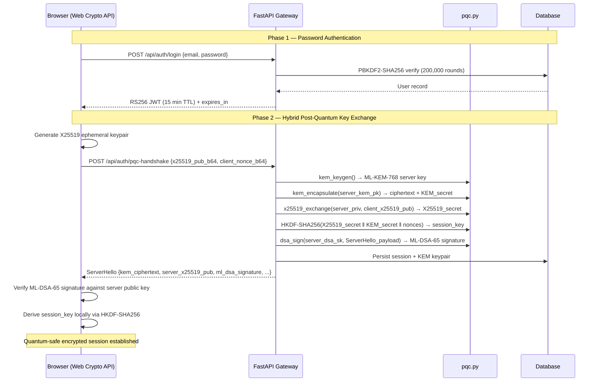

<div align="center">


# QuantumSentinel

**The World's First Open-Source Post-Quantum Secure Trading Terminal with an Institutional-Grade Quant Research Engine**

[](https://python.org)
[](https://fastapi.tiangolo.com)
[](tests/)
[](https://csrc.nist.gov/pubs/fips/203/final)
[](https://csrc.nist.gov/pubs/fips/204/final)
[](LICENSE)
[](docker-compose.yml)
[](SECURITY.md)

*Quantum-safe cryptography · Realistic backtesting engine · Walk-forward validation · Factor modeling · C++ accelerated kernels*

</div>

---

> **Safety boundary:** QuantumSentinel is paper-trading and research software. It is not a live brokerage, custodian, financial adviser, or production-certified cryptographic service. Never connect production financial credentials without completing the hardening steps in [SECURITY.md](SECURITY.md).

---

## What Makes QuantumSentinel Different?

Two things that rarely appear together — in one open-source codebase:

**Post-Quantum Cryptography (production-grade)**
- Every session begins with a **hybrid X25519 + ML-KEM-768** key exchange — combining classical and post-quantum cryptography per FIPS 203
- Every order is signed with **ML-DSA-65** (FIPS 204) — quantum-safe lattice signatures
- Every audit log entry is server-signed and **browser-verifiable** in real time
- Passwords hashed with PBKDF2-SHA256 at 200,000 rounds; keys encrypted at rest with AES-256-GCM

**Serious Quant Research Engine (institutional-grade)**
- Backtested systematic strategies **under realistic transaction-cost and execution assumptions** — not toy MA crossovers with perfect fills
- Walk-forward validation that actually catches overfitting — not just in-sample Sharpe
- Fama-MacBeth cross-sectional factor regressions with Newey-West corrected t-statistics
- Deflated Sharpe Ratio, block bootstrap, permutation testing — statistical guard rails that quant desks actually use
- C++ kernels (pybind11) for rolling correlation, HMM forward pass, and backtest loop — with transparent NumPy fallback

---

## System Architecture


```mermaid
flowchart TB
    subgraph Client["Browser Client"]
        FE["Vanilla JS SPA\nWeb Crypto API · No build step required"]
    end

    subgraph Gateway["FastAPI Gateway"]
        MW["Security Middleware\nCORS · Rate Limiter · CSP · Security Headers"]
        AUTH_MW["JWT Bearer Auth\nDepends(get_current_user)"]
        WS["WebSocket Stream\n/api/signals/stream"]
        SPA["SPA Catch-all\n/{path:path} → index.html"]
    end

    subgraph PQC["PQC Crypto Layer (pqc.py)"]
        KEM["ML-KEM-768\nFIPS 203\n1184B pk · 1088B ct · 32B ss"]
        DSA["ML-DSA-65\nFIPS 204\n1952B pk · 3309B sig"]
        X25519["X25519\nRFC 7748\nClassical hybrid leg"]
        HKDF["HKDF-SHA256\nSession key derivation"]
        KEM --- HKDF
        X25519 --- HKDF
    end

    subgraph CoreSvcs["Core Services"]
        AUTH["auth_service\nJWT · PBKDF2 · PQC Handshake\nNonce TTL · Session store"]
        SIG["signal_engine\nSBA · RSI-14 · MACD 12/26/9\nLive price · 20s/15s cache"]
        TRADE["trading_service\nOrder lifecycle · Alpaca SDK\nMarket simulator · Fill logic"]
        PORT["portfolio_service\nPositions · Equity curve\nSharpe · VaR · Drawdown"]
        SEC["security_service\nServer ML-DSA identity\nAudit log · 90-day rotation"]
        INTG["integration_service\nScoped API keys\nHMAC-signed webhooks"]
    end

    subgraph Research["Quant Research Engine"]
        BACK["backtest_service\nEvent-driven · Execution model\nCommission · spread · slippage"]
        WF["walk_forward\nRolling/Expanding windows\nOOS Sharpe · Overfitting flag"]
        ALPHA["alpha_research\nIC · Rank IC · ICIR\nDecay analysis · Quintile returns"]
        FACTOR["factor_model\nFama-MacBeth regression\nNewey-West t-statistics"]
        CORR["correlation_engine\nShrinkage (Ledoit-Wolf)\nPCA denoising"]
        OPT["portfolio_optimization\nMean-Variance · Black-Litterman\nRisk-Parity · Efficient Frontier"]
        REGIME["regime_detection\n2-state HMM · Viterbi\nVol/Trend regime"]
        STAT["stat_tests\nDSR · Bootstrap CI\nPermutation · ADF · Cointegration"]
        NEUTRAL["neutral_strategies\nPairs trading · Kalman filter\nOU half-life"]
        CPP["cpp_ext\nC++ kernels (pybind11)\nNumPy fallback"]
        BENCH["latency_bench\np50/p95/p99/p99.9\nC++ vs Python speedup"]
        REPORT["report_generator\n7-section JSON report\nExecutive → Frontier"]
    end

    subgraph Persistence["Persistence"]
        DB[("SQLite / PostgreSQL\nSQLAlchemy 2.0")]
        REDIS[("Redis\nRate limiting · Sessions\nIn-memory fallback in dev")]
    end

    subgraph External["External APIs"]
        YF["Yahoo Finance\n3-month OHLCV · fast_info"]
        ALPACA["Alpaca Paper API\npaper-api.alpaca.markets"]
    end

    Client <-->|"HTTPS / WSS · Bearer JWT"| Gateway
    Gateway --> AUTH_MW --> CoreSvcs
    Gateway --> AUTH_MW --> Research
    Gateway --> WS --> SIG
    Gateway --> SPA

    AUTH --> PQC
    SEC --> PQC
    TRADE --> PQC

    CoreSvcs --> DB
    CoreSvcs --> REDIS

    SIG --> YF
    TRADE --> ALPACA

    Research --> CPP
    REPORT --> WF & FACTOR & REGIME & STAT & OPT & ALPHA
```

---

## Research Pipeline — End to End


```mermaid
flowchart LR
    YF["Yahoo Finance\nOHLCV · fast_info\nAny world ticker"]

    subgraph FE["Feature Engineering"]
        F1["Momentum · Reversal\n20-day / cross-sectional"]
        F2["Volatility · Quality\nSharpe-weighted"]
        F3["SBA Spin · HMM State\nQuantum-inspired + regime"]
    end

    subgraph EXEC["Execution Simulator"]
        E1["1-bar execution delay"]
        E2["Bid-ask spread (bps)"]
        E3["Commission model"]
        E4["Slippage (market impact)"]
        E5["Short selling + borrow cost"]
        E6["Leverage limits · Cash constraints"]
        E7["Partial fills"]
    end

    subgraph WF["Walk-Forward Validation"]
        W1["Rolling window splits"]
        W2["Expanding window splits"]
        W3["Per-fold IS optimization"]
        W4["Per-fold OOS Sharpe"]
        W5["Overfitting detection flag"]
    end

    subgraph FACTOR["Factor & Regime"]
        FA["Fama-MacBeth\nCross-sectional regression"]
        HMM["2-state HMM\nBull/Bear detection"]
        NW["Newey-West\nAutocorrelation-corrected t-stats"]
    end

    subgraph STAT["Statistical Validation"]
        S1["Newey-West t-statistic"]
        S2["Deflated Sharpe Ratio (DSR)"]
        S3["Block Bootstrap CI (95%)"]
        S4["Permutation p-value"]
        S5["Ljung-Box autocorrelation"]
        S6["ADF unit-root test"]
    end

    subgraph RISK["Risk Decomposition"]
        R1["CVaR 1% / 5%"]
        R2["Sortino · Calmar · Omega"]
        R3["Max drawdown · Duration"]
        R4["Turnover analysis"]
    end

    YF --> FE --> EXEC --> WF --> FACTOR --> STAT --> RISK --> RPT

    RPT["7-Section\nResearch Report\nJSON output"]
```

---

## PQC Hybrid Handshake Protocol


```mermaid
sequenceDiagram
    participant BR as Browser (Web Crypto API)
    participant GW as FastAPI Gateway
    participant PQC as pqc.py
    participant DB as Database

    Note over BR,DB: Phase 1 — Password Authentication
    BR->>GW: POST /api/auth/login {email, password}
    GW->>DB: PBKDF2-SHA256 verify (200,000 rounds)
    DB-->>GW: User record
    GW-->>BR: RS256 JWT (15 min TTL) + expires_in

    Note over BR,DB: Phase 2 — Hybrid Post-Quantum Key Exchange
    BR->>BR: Generate X25519 ephemeral keypair
    BR->>GW: POST /api/auth/pqc-handshake {x25519_pub_b64, client_nonce_b64}
    GW->>PQC: kem_keygen() → ML-KEM-768 server key
    GW->>PQC: kem_encapsulate(server_kem_pk) → ciphertext + KEM_secret
    GW->>PQC: x25519_exchange(server_priv, client_x25519_pub) → X25519_secret
    GW->>PQC: HKDF-SHA256(X25519_secret ‖ KEM_secret ‖ nonces) → session_key
    GW->>PQC: dsa_sign(server_dsa_sk, ServerHello_payload) → ML-DSA-65 signature
    GW->>DB: Persist session + KEM keypair
    GW-->>BR: ServerHello {kem_ciphertext, server_x25519_pub, ml_dsa_signature, ...}
    BR->>BR: Verify ML-DSA-65 signature against server public key
    BR->>BR: Derive session_key locally via HKDF-SHA256
    Note over BR: Quantum-safe encrypted session established
```

---

## Database Schema


```mermaid
erDiagram
    users {
        string id PK
        string email UK
        string password_hash
        boolean is_admin
        boolean is_active
        datetime created_at
    }
    trades {
        string id PK
        string user_id FK
        string asset
        string side
        float quantity
        string order_type
        string status
        float filled_price
        string pqc_signature
        datetime submitted_at
    }
    positions {
        string id PK
        string user_id FK
        string asset
        float quantity
        float avg_entry_price
        float realized_pnl
        datetime updated_at
    }
    key_pairs {
        string id PK
        string user_id FK
        string algorithm
        text public_key_b64
        boolean is_active
        int rotation_count
        datetime created_at
    }
    audit_logs {
        string id PK
        string user_id FK
        string action
        string resource_type
        string pqc_signature
        datetime created_at
    }
    api_keys {
        string id PK
        string user_id FK
        string name
        string prefix
        json scopes
        boolean is_revoked
        datetime expires_at
    }
    webhooks {
        string id PK
        string user_id FK
        string url
        json event_types
        boolean is_active
        datetime last_delivery_at
    }

    users ||--o{ trades : "places"
    users ||--o{ positions : "holds"
    users ||--o{ key_pairs : "owns"
    users ||--o{ audit_logs : "generates"
    users ||--o{ api_keys : "manages"
    users ||--o{ webhooks : "configures"
```

---

## Capabilities at a Glance

### Post-Quantum Cryptography

| What | How | Standard |
|---|---|---|
| Session key exchange | Hybrid X25519 + ML-KEM-768 → HKDF-SHA256 | FIPS 203, RFC 7748 |
| Order signing | ML-DSA-65 lattice signature on every order | FIPS 204 |
| Audit trail | Server-signed, browser-verifiable entries | FIPS 204 |
| Password hashing | PBKDF2-SHA256, 200,000 rounds | NIST SP 800-132 |
| Keys at rest | AES-256-GCM (Fernet) encryption | NIST SP 800-38D |
| JWT auth | RS256, 15-min TTL, nonce replay protection | RFC 7518 |
| Key rotation | 90-day policy enforced on ML-KEM + ML-DSA keypairs | FIPS 203/204 |

### Research Engine

| Module | Capabilities |
|---|---|
| **Backtest Engine** | Event-driven loop · 1-bar execution delay · commission model · bid-ask spread · slippage · short selling · borrow costs · leverage limits · cash constraints · partial fills |
| **Walk-Forward Validation** | Rolling & expanding windows · per-fold IS parameter optimisation · per-fold OOS Sharpe · overfitting detection flag · IS/OOS degradation analysis |
| **Alpha Research** | IC · Rank IC · ICIR · hit rate · decay analysis (1–20 bar horizon) · quintile/decile returns · signal turnover · long-short spread |
| **Fama-MacBeth Factor Model** | Cross-sectional regression · Newey-West autocorrelation-corrected t-statistics · factor premia per asset · per-period R² · factor significance testing |
| **Correlation Engine** | Sample covariance · Ledoit-Wolf shrinkage · PCA denoising · shrinkage intensity optimisation · rolling 252-day window |
| **Portfolio Optimisation** | Mean-variance (Markowitz) · Black-Litterman · Risk-Parity · Min-Volatility · Equal-Weight · efficient frontier computation |
| **HMM Regime Detection** | 2-state Gaussian HMM (bull/bear) · Viterbi sequence decoding · volatility regime · trend regime · transition probability matrix |
| **Statistical Testing** | Newey-West t-test · Deflated Sharpe Ratio (DSR) · block bootstrap CI · permutation p-value · Ljung-Box autocorrelation · ADF unit-root · Durbin-Watson · Engle-Granger cointegration |
| **Stat Arb / Pairs Trading** | Engle-Granger cointegration · Kalman filter hedge ratio · z-score entry/exit signals · Ornstein-Uhlenbeck half-life · spread mean-reversion test |
| **C++ Kernels** | pybind11 extension: `rolling_corr` (T×N×N) · `hmm_forward` (scaled forward algorithm) · `backtest_loop` — numerically identical NumPy fallback |
| **Latency Profiler** | `TimerStats` dataclass · per-stage repeated runs · p50/p95/p99/p99.9 percentiles · C++ vs Python speedup benchmark with numerical equivalence check |
| **Research Report** | 7-section structured JSON output covering the full pipeline from executive summary to efficient frontier |

### Trading Terminal

- **Signal Engine** — SBA + RSI-14 + MACD 12/26/9 + 20-day momentum + Bollinger Band Width + AI-generated insight text
- **Live Prices** — 5s micro-cached `fast_info` prices for any world ticker via Yahoo Finance
- **Asset Intelligence** — Instrument type · exchange · market open/closed status · fractional & 24/7 flags
- **Paper Trading** — Alpaca paper API integration + built-in Yahoo Finance price simulator
- **Order Types** — Market / Limit / Stop / Stop-Limit · Day / GTC / IOC · 30s duplicate guard · oversell prevention · dynamic 5% cap
- **Global Markets** — 9 exchanges: NYSE/NASDAQ, NSE/BSE, LSE, Xetra, TSE, HKEX, ASX, TSX, Crypto — with live market-hours detection
- **Portfolio Risk** — Mark-to-market positions · unrealised/realised P&L · equity curve · Sharpe · VaR 95/99 · CSV export
- **Enterprise SDK** — Scoped `X-QS-API-KEY` credentials: `read` / `trade` / `admin` · SHA-256 stored hash
- **Signed Webhooks** — HTTPS-only · HMAC-SHA256 event signatures · Fernet-encrypted secrets at rest
- **Observability** — Prometheus metrics (HTTP request counts, latency histograms) behind auth guard

---

## Repository Structure

```
quantumsentinel-web/
│
├── backend/
│   ├── main.py                          ← Central router · middleware · WebSocket · SPA fallback
│   ├── models.py                        ← SQLAlchemy 2.0 schema (8 tables)
│   ├── schemas.py                       ← Pydantic v2 request/response validation (all endpoints)
│   ├── database.py                      ← Engine · session factory · init_db()
│   ├── config.py                        ← ENV-driven config with production safety constraints
│   │
│   ├── crypto/
│   │   └── pqc.py                       ← ML-KEM-768 · ML-DSA-65 · X25519 · HKDF · registry
│   │
│   └── services/
│       │   ── Core Services ─────────────────────────────────────────────
│       ├── auth_service.py              ← JWT · PBKDF2 · PQC handshake · nonce TTL store
│       ├── signal_engine.py             ← SBA · RSI · MACD · live price · asset info · caching
│       ├── trading_service.py           ← Order lifecycle · Alpaca SDK · local simulator
│       ├── portfolio_service.py         ← Positions · mark-to-market · equity curve · Sharpe · VaR
│       ├── security_service.py          ← Server ML-DSA identity · audit log · key health
│       ├── integration_service.py       ← Scoped API keys · SSRF-guarded signed webhooks
│       │
│       │   ── Research Engine ─────────────────────────────────────────
│       ├── backtest_service.py          ← Event-driven backtest with full execution cost model
│       ├── execution_model.py           ← Commission · spread · slippage · borrow cost models
│       ├── walk_forward.py              ← Rolling/expanding walk-forward OOS validation
│       ├── alpha_research.py            ← IC · Rank IC · ICIR · decay analysis · quintile returns
│       ├── factor_model.py              ← Fama-MacBeth cross-sectional regression · Newey-West
│       ├── correlation_engine.py        ← Shrinkage (Ledoit-Wolf) · PCA denoising
│       ├── portfolio_optimization.py    ← Mean-variance · Black-Litterman · Risk-Parity · frontier
│       ├── regime_detection.py          ← 2-state HMM · Viterbi · vol/trend regime
│       ├── stat_tests.py                ← DSR · bootstrap · permutation · ADF · cointegration
│       ├── neutral_strategies.py        ← Pairs trading · Kalman filter · OU half-life
│       ├── report_generator.py          ← 7-section structured JSON research report
│       ├── cpp_ext.py                   ← C++ kernel wrapper + NumPy fallback (auto-selects)
│       └── latency_bench.py             ← p50/p95/p99/p99.9 pipeline profiler + C++ speedup
│
├── cpp/                                 ← C++ performance kernels (pybind11)
│   ├── qs_fast.cpp                      ← rolling_corr · hmm_forward · backtest_loop
│   ├── setup.py                         ← Cross-platform build: MinGW (Windows) / GCC / Clang
│   └── _qs_fast.cp313-win_amd64.pyd    ← Pre-built Windows extension (Python 3.13)
│
├── frontend/                            ← Vanilla JS SPA (zero build step)
│   ├── index.html                       ← App shell · 7-tab navigation · all forms
│   ├── app.js                           ← ~2100-line SPA: auth · trading · portfolio · WS
│   ├── bg3d.js                          ← Three.js 3D particle background engine
│   ├── styles.css                       ← Glassmorphism · micro-animations · mobile-first
│   └── favicon.ico                      ← Quantum diamond icon
│
├── tests/                               ← Pytest suite — 241 tests · 100% pass rate
│   ├── test_auth.py                     ← Authentication & PQC handshake
│   ├── test_trading.py                  ← Order lifecycle & fills
│   ├── test_portfolio.py                ← Risk metrics
│   ├── test_backtest.py                 ← Execution engine & cost models
│   ├── test_research.py                 ← Walk-forward · alpha · factor model
│   ├── test_phase3.py                   ← Stat tests · regime detection · pairs trading
│   └── test_phase4.py                   ← C++ kernels · p50/p99 latency · report generator
│
├── deploy/
│   ├── nginx.conf                       ← TLS 1.3 reverse proxy with HSTS
│   └── tls/                             ← Certificate mount point
│
├── .env.example                         ← All environment variables documented
├── Dockerfile                           ← Multi-stage Python image
├── docker-compose.yml                   ← Dev/demo: SQLite, single container
├── docker-compose.production.yml        ← Prod: PostgreSQL + Redis + Nginx + Gunicorn
├── requirements.txt                     ← Pinned dependencies
├── SECURITY.md                          ← Threat model · hardening checklist · responsible disclosure
└── README.md                            ← This file
```

---

## Quick Start

### Prerequisites

| Requirement | Notes |
|---|---|
| **Python 3.13+** | Official CPython from [python.org](https://python.org) — required for C++ extension ABI compatibility |
| **Git** | Any recent version |
| **C++ compiler** *(optional)* | MinGW-W64 GCC 16+ (Windows) · GCC 11+ (Linux) · Clang 14+ (macOS) — only needed for C++ kernel speedup |

### 1 — Clone & Install

```bash
git clone https://github.com/BugHunterX2101/quantumsentinel-web.git
cd quantumsentinel-web

python -m venv .venv

# Windows
.venv\Scripts\activate

# macOS / Linux
source .venv/bin/activate

pip install -r requirements.txt
```

### 2 — Configure (optional)

```bash
# Windows
copy .env.example .env

# macOS / Linux
cp .env.example .env
```

- Set `ALPACA_API_KEY` + `ALPACA_SECRET_KEY` for live paper execution via Alpaca
- Without them, orders settle against the latest Yahoo Finance price in the built-in simulator

### 3 — Run

```bash
uvicorn backend.main:app --host 127.0.0.1 --port 8000 --reload
```

- App: **http://127.0.0.1:8000**
- Interactive API docs: **http://127.0.0.1:8000/docs**

---

## Build the C++ Extension (Optional Performance Upgrade)

The C++ kernels deliver hardware-accelerated performance for large datasets. Without them, all functionality is preserved via numerically identical NumPy fallbacks — `CPP_AVAILABLE` tells you which mode is active.

```bash
# ── Windows (MinGW-W64) ──────────────────────────────────────────────────────
winget install BrechtSanders.WinLibs.POSIX.UCRT   # Install MinGW
pip install pybind11 setuptools

cd cpp
python setup.py build_ext --inplace --compiler=mingw32

# ── Linux / macOS ────────────────────────────────────────────────────────────
cd cpp && pip install -e .

# ── Verify ───────────────────────────────────────────────────────────────────
python -c "from backend.services.cpp_ext import CPP_AVAILABLE; print('C++ kernels:', CPP_AVAILABLE)"
```

Check extension status at runtime: `GET /api/research/cpp-status`

**C++ Kernels:**
- **`rolling_corr(X, window)`** — Rolling Pearson correlation tensor (T × N × N) — used by correlation engine and SBA signal
- **`hmm_forward(obs, pi, A, mu, sigma)`** — Scaled HMM forward algorithm — used by regime detection
- **`backtest_loop(prices, signals, commission, spread_bps)`** — Full backtest event loop — used by backtest engine

---

## API Reference

### Research Engine Endpoints

| Method | Endpoint | Description |
|---|---|---|
| `POST` | `/api/research/backtest` | Event-driven backtest with commission · spread · slippage · execution delay |
| `POST` | `/api/research/walk-forward` | Rolling/expanding OOS validation with per-fold Sharpe and overfitting detection |
| `POST` | `/api/research/alpha` | IC · Rank IC · ICIR · hit rate · decay analysis · quintile/decile returns |
| `POST` | `/api/research/factor-model` | Fama-MacBeth cross-sectional regression with Newey-West t-statistics |
| `POST` | `/api/research/correlation` | Shrinkage (Ledoit-Wolf) and PCA-denoised correlation matrix estimation |
| `POST` | `/api/research/portfolio-optimization` | Mean-variance · Black-Litterman · Risk-Parity · Min-Vol · efficient frontier |
| `POST` | `/api/research/regime-detection` | 2-state Gaussian HMM · Viterbi decoding · volatility and trend regime |
| `POST` | `/api/research/stat-tests` | Newey-West · DSR · block bootstrap CI · permutation p-value · ADF · cointegration |
| `POST` | `/api/research/pairs-trading` | Engle-Granger cointegration · Kalman filter hedge ratio · z-score signal · OU half-life |
| `POST` | `/api/research/sba-backtest` | SBA quantum-inspired combinatorial optimizer backtest |
| **`POST`** | **`/api/research/report`** | **Full 7-section research report across all pipeline stages** |
| `POST` | `/api/research/latency-benchmark` | Per-stage p50/p99 latency profile + C++ vs Python speedup benchmark |
| `GET`  | `/api/research/cpp-status` | C++ extension load status · kernel names · active mode |

### Research Report — 7-Section JSON Structure

```json
{
  "executive_summary": {
    "sharpe_ratio": 1.42,
    "max_drawdown": -0.087,
    "alpha": 0.063,
    "information_ratio": 0.91,
    "annualized_return": 0.187,
    "annualized_vol": 0.131,
    "avg_daily_turnover": 0.18
  },
  "walk_forward_table": [
    { "fold": 1, "train_start": "2022-01-03", "test_end": "2022-06-30", "oos_sharpe": 1.21, "degraded": false },
    { "fold": 2, "train_start": "2022-01-03", "test_end": "2022-12-30", "oos_sharpe": 0.98, "degraded": false }
  ],
  "factor_premia_table": [
    { "factor": "momentum", "premium": 0.041, "t_stat": 3.5, "significant_5pct": true },
    { "factor": "volatility", "premium": -0.028, "t_stat": -2.1, "significant_5pct": true }
  ],
  "regime_statistics": {
    "current_state": "bull", "bull_prob_pct": 72.4,
    "n_regime_switches": 14, "avg_bull_duration_days": 32
  },
  "statistical_validation": {
    "newey_west_t": 3.12, "survives_deflation": true,
    "bootstrap_ci_95": [0.85, 1.98], "permutation_p_value": 0.02
  },
  "risk_decomposition": {
    "cvar_1pct": -0.031, "cvar_5pct": -0.019,
    "sortino_ratio": 1.87, "calmar_ratio": 2.1, "omega_ratio": 1.43,
    "skewness": -0.14, "excess_kurtosis": 0.88
  },
  "efficient_frontier": [
    { "vol": 0.10, "return": 0.07 }, { "vol": 0.12, "return": 0.09 }
  ]
}
```

### Core Platform Endpoints

| Area | Method | Endpoint | Auth | Notes |
|---|---|---|---|---|
| **Auth** | `POST` | `/api/auth/register` | — | PBKDF2-SHA256, 200k rounds |
| | `POST` | `/api/auth/login` | — | Returns RS256 JWT |
| | `POST` | `/api/auth/pqc-handshake` | JWT | Hybrid X25519 + ML-KEM-768 |
| **Signals** | `GET` | `/api/signals/latest` | JWT | 20 preloaded assets, 20s cache |
| | `GET` | `/api/signals/asset/{ticker}` | JWT | Any world ticker, 15s cache |
| | `WS` | `/api/signals/stream` | JWT | Live push with exponential backoff |
| **Live Market** | `GET` | `/api/price/{ticker}` | JWT | Always-fresh 5s micro-cache |
| | `GET` | `/api/asset/info/{ticker}` | JWT | Instrument type, exchange, market open/closed |
| **Trading** | `POST` | `/api/trading/orders` | JWT | ML-DSA-65 signed order |
| | `GET` | `/api/trading/orders` | JWT | Full order history |
| | `DELETE` | `/api/trading/orders/{id}` | JWT | Cancel pending order |
| **Watchlist** | `GET/PUT` | `/api/watchlist` | JWT | Get / replace full list |
| | `POST/DELETE` | `/api/watchlist/{ticker}` | JWT | Add / remove ticker |
| **Portfolio** | `GET` | `/api/portfolio/positions` | JWT | Mark-to-market positions |
| | `GET` | `/api/portfolio/risk-metrics` | JWT | Sharpe, VaR 95/99 |
| | `GET` | `/api/portfolio/export` | JWT | CSV download |
| **Security** | `GET` | `/api/security/health` | JWT | Key age, rotation status |
| | `GET` | `/api/security/audit-log` | JWT | ML-DSA-65 verified entries |
| | `POST` | `/api/security/rotate-keys` | JWT | New KEM + DSA keypair |
| | `GET` | `/api/security/compliance-report` | JWT | FIPS 203/204 compliance report |
| **SDK** | `GET` | `/api/sdk/portfolio` | `X-QS-API-KEY` (read) | Machine-to-machine |
| | `POST` | `/api/sdk/orders` | `X-QS-API-KEY` (trade) | Programmatic orders |
| **Integrations** | `GET/POST` | `/api/integrations/api-keys` | JWT | Scoped credentials |
| | `GET/POST` | `/api/integrations/webhooks` | JWT | HMAC-SHA256 signed |
| **Observability** | `GET` | `/metrics` | JWT | Prometheus counters/histograms |
| | `GET` | `/health/live` | — | Liveness probe |
| | `GET` | `/health/ready` | — | Readiness (DB + Redis check) |

---

## Security Architecture

### Cryptographic Specifications

| Algorithm | Role | Key Sizes | Compliance |
|---|---|---|---|
| **ML-KEM-768** | Post-quantum key encapsulation | pk: 1184B · sk: 2400B · ct: 1088B · ss: 32B | FIPS 203 |
| **ML-DSA-65** | Post-quantum digital signatures | pk: 1952B · sk: 4032B · sig: 3309B | FIPS 204 |
| **X25519** | Classical hybrid KEM leg | pk: 32B · ss: 32B | RFC 7748 |
| **HKDF-SHA256** | Session key derivation | 32B output | RFC 5869 |
| **RS256 (RSA-2048)** | JWT signing | 2048-bit | RFC 7518 |
| **PBKDF2-SHA256** | Password hashing | 200,000 rounds | NIST SP 800-132 |
| **AES-256-GCM** (Fernet) | Key/secret encryption at rest | 256-bit | NIST SP 800-38D |

### Production Hardening Checklist

- [ ] Generate and persist `JWT_PRIVATE_KEY` / `JWT_PUBLIC_KEY` (RS256)
- [ ] Set `SERVER_DSA_PRIVATE_KEY` / `SERVER_DSA_PUBLIC_KEY` (audit log integrity across restarts)
- [ ] Configure `WEBHOOK_ENCRYPTION_KEY` and `PRIVATE_KEY_ENCRYPTION_KEY` (Fernet)
- [ ] Replace `reference` PQC backend with a reviewed liboqs/HSM adapter
- [ ] Enable PostgreSQL with encrypted connections
- [ ] Configure Redis with AUTH password and AOF persistence
- [ ] Set strict `CORS_ORIGINS` and `ALLOWED_HOSTS` — no wildcards in production
- [ ] Place TLS 1.3 certificates at `deploy/tls/fullchain.pem` and `deploy/tls/privkey.pem`
- [ ] Rotate ML-KEM-768 and ML-DSA-65 keys within the 90-day policy enforced by `security_service`

Read [SECURITY.md](SECURITY.md) for the full threat model and responsible disclosure policy.

---

## Configuration Reference

All variables are documented in [`.env.example`](.env.example):

| Variable | Required | Description |
|---|---|---|
| `ENVIRONMENT` | No | `development` (default) or `production` |
| `DATABASE_URL` | No | SQLite by default; set Postgres DSN for production |
| `JWT_PRIVATE_KEY` | Prod | RS256 private key (PEM, `\n`-escaped) |
| `JWT_PUBLIC_KEY` | Prod | RS256 public key (PEM, `\n`-escaped) |
| `WEBHOOK_ENCRYPTION_KEY` | Prod | Fernet key for encrypting webhook signing secrets at rest |
| `PRIVATE_KEY_ENCRYPTION_KEY` | Prod | Fernet key for encrypting user ML-DSA private keys in DB |
| `SERVER_DSA_PRIVATE_KEY` | Prod | Persistent ML-DSA-65 server signing key (base64) |
| `SERVER_DSA_PUBLIC_KEY` | Prod | Corresponding public key for audit log verification |
| `SERVER_DSA_CREATED_AT` | Prod | ISO timestamp of server key creation |
| `PQC_PROVIDER` | Prod | Must be set to non-`reference` value in production |
| `PQC_PROVIDER_URL` | Prod | URL to the external liboqs/HSM PQC adapter |
| `CORS_ORIGINS` | Prod | Comma-separated allowed origins (no wildcards) |
| `ALLOWED_HOSTS` | Prod | Comma-separated allowed hostnames |
| `REDIS_URL` | Prod | For distributed rate limiting and session storage |
| `ALPACA_API_KEY` | No | Alpaca paper trading key |
| `ALPACA_SECRET_KEY` | No | Alpaca paper trading secret |

---

## Cache TTL Reference

| Cache | TTL | Description |
|---|---|---|
| Preloaded signals | 20 s | 20 blue-chip assets computed concurrently at startup |
| On-demand signals | 15 s | Any ticker searched live via the dashboard search bar |
| Live price | 5 s | `/api/price/{ticker}` micro-cache — nearly real-time |
| Asset info | 30 s | Instrument type, exchange, market status, trading features |

---

## Docker

### Development (SQLite)

```bash
docker compose up --build
# → http://localhost:8000
```

### Production (PostgreSQL + Redis + Nginx TLS)

```bash
# 1. Generate RSA keypair for JWT RS256
python -c "
from cryptography.hazmat.primitives.asymmetric import rsa
from cryptography.hazmat.primitives import serialization
k = rsa.generate_private_key(65537, 2048)
print('PRIVATE:', k.private_bytes(serialization.Encoding.PEM, serialization.PrivateFormat.TraditionalOpenSSL, serialization.NoEncryption()).decode().replace('\n','\\n'))
print('PUBLIC:', k.public_key().public_bytes(serialization.Encoding.PEM, serialization.PublicFormat.SubjectPublicKeyInfo).decode().replace('\n','\\n'))
"

# 2. Fill production env
cp .env.production.example .env.production

# 3. Place TLS certs at deploy/tls/

# 4. Deploy
docker compose -f docker-compose.production.yml --env-file .env.production up -d --build
```

> [!IMPORTANT]
> Production mode deliberately refuses the bundled pure-Python reference PQC backend.
> Set `PQC_PROVIDER` and `PQC_PROVIDER_URL` only after integrating a reviewed liboqs/HSM adapter.

---

## Verification

```bash
# Run the full test suite — 241 must pass
pytest tests/ -v

# Python syntax check — all research modules
python -m py_compile \
    backend/main.py backend/schemas.py backend/models.py \
    backend/crypto/pqc.py \
    backend/services/auth_service.py \
    backend/services/signal_engine.py \
    backend/services/backtest_service.py \
    backend/services/walk_forward.py \
    backend/services/alpha_research.py \
    backend/services/factor_model.py \
    backend/services/correlation_engine.py \
    backend/services/portfolio_optimization.py \
    backend/services/regime_detection.py \
    backend/services/stat_tests.py \
    backend/services/neutral_strategies.py \
    backend/services/report_generator.py \
    backend/services/cpp_ext.py \
    backend/services/latency_bench.py

# JavaScript syntax check
node --check frontend/app.js

# C++ extension status
python -c "from backend.services.cpp_ext import CPP_AVAILABLE; print('C++ kernels:', CPP_AVAILABLE)"

# Docker health check
docker compose up --build -d && curl http://localhost:8000/health/ready
```

---

## Development Roadmap

| Phase | Status | Key Deliverables |
|---|---|---|
| **Phase 1** — Research Engine | Complete | Event-driven backtest · execution simulator · commission/spread/slippage/borrow/leverage |
| **Phase 2** — Walk-Forward & Alpha | Complete | Rolling/expanding WF · IC/Rank IC/ICIR · decay analysis · quintile returns · signal turnover |
| **Phase 3** — Factor & Statistics | Complete | Fama-MacBeth · DSR · ADF/cointegration · pairs trading · portfolio optimisation |
| **Phase 4** — Performance & Reporting | Complete | C++ kernels (pybind11) · p50/p99 latency profiler · 7-section JSON report generator |

---

## Contributing

Contributions of all sizes are welcome — from bug fixes and documentation improvements to new research modules and cryptographic integrations.

### Workflow

1. **Fork** the repository and clone your fork locally.
2. **Create a feature branch** from `main` using a descriptive name:
   ```bash
   git checkout -b fix/walk-forward-expanding-window
   git checkout -b feat/add-kalman-filter-regime
   git checkout -b docs/update-api-reference
   ```
3. **Make your changes.** Keep commits atomic and focused on a single concern.
4. **Run the full test suite** before pushing — all 241 tests must pass:
   ```bash
   pytest tests/ -v
   ```
5. **Add tests** for any new functionality. New research modules should have corresponding tests in `tests/` following the pattern established in `test_phase3.py` and `test_phase4.py`.
6. **Commit** using the [Conventional Commits](https://www.conventionalcommits.org/) format:
   ```
   feat: add Kalman-filter-based regime transition model
   fix: correct Newey-West lag selection for short time series
   docs: document DSR formula and assumptions in stat_tests.py
   test: add walk-forward parity tests for expanding window mode
   refactor: extract execution cost model into execution_model.py
   ```
7. **Push** and open a Pull Request against `main`. Describe *what* changed, *why*, and any design trade-offs you considered.

### Code Standards

- **Python style:** PEP 8. Type annotations on all public functions and class methods. Docstrings on every module, class, and non-trivial function.
- **Pydantic schemas:** Any new API endpoint must have a corresponding request schema in `schemas.py` with field validators and a descriptive docstring.
- **No breaking changes to existing API contracts** without a deprecation path documented in the PR description.
- **Research modules** must return plain Python types (no raw NumPy scalars or arrays) so all API responses are JSON-serialisable.
- **Cryptographic code** must not introduce new dependencies without explicit justification and review against the threat model in [SECURITY.md](SECURITY.md).

### Pull Request Checklist

- [ ] All 241 existing tests pass: `pytest tests/ -v`
- [ ] New functionality is covered by at least one new test
- [ ] Public functions have type annotations and docstrings
- [ ] No raw NumPy types leak into API response payloads
- [ ] `python -m py_compile` passes on all modified modules
- [ ] PR description explains the change and links to any relevant issues

### Security Issues

Do **not** open a public GitHub issue to report security vulnerabilities. Follow the responsible disclosure process documented in [SECURITY.md](SECURITY.md).

---

## License

Apache-2.0 — see [LICENSE](LICENSE).

---

<div align="center">

*QuantumSentinel is research and informational software.*
*It is not financial advice and carries no certification for use in regulated financial systems.*

</div>
