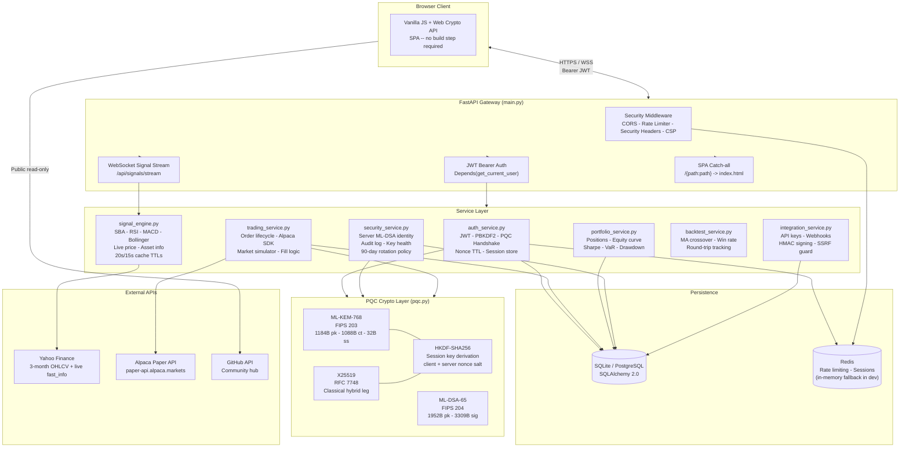
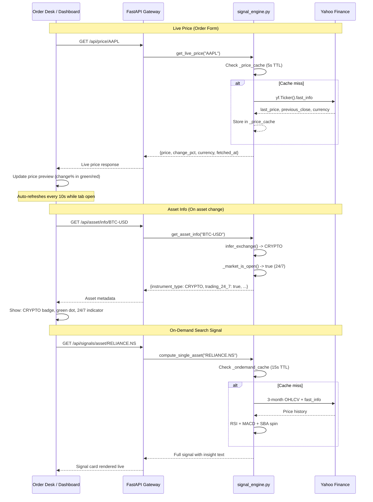
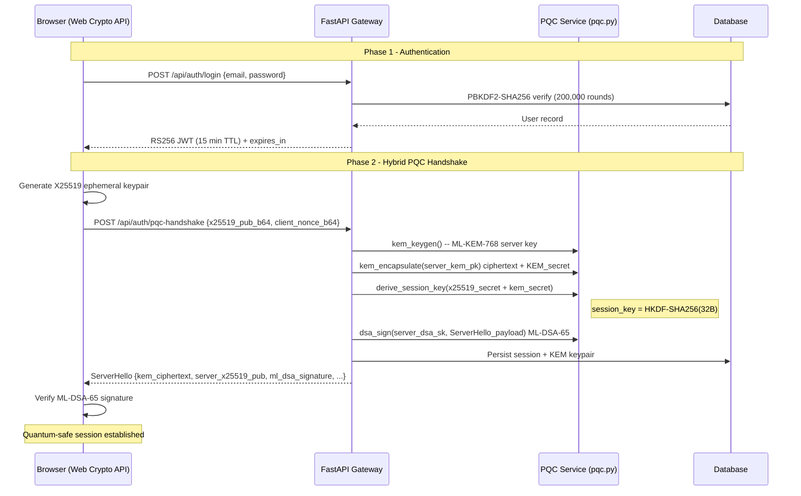
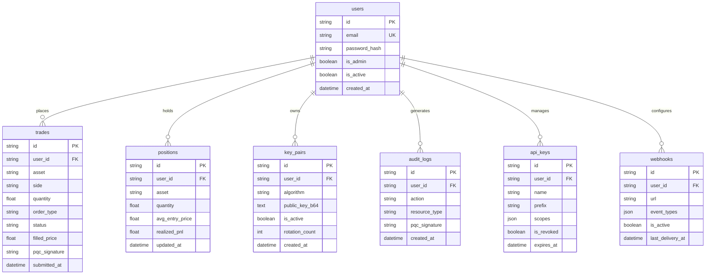

<div align="center">


# QuantumSentinel

### The World's First Open-Source Post-Quantum Secure Trading Terminal

[](https://python.org)
[](https://fastapi.tiangolo.com)
[](https://csrc.nist.gov/pubs/fips/203/final)
[](https://csrc.nist.gov/pubs/fips/204/final)
[](LICENSE)
[](docker-compose.yml)
[](SECURITY.md)

*Quantum-safe cryptography · Real-time market signals · Signed audit trail · Zero real money*

</div>

---

> **Safety boundary:** QuantumSentinel is paper-trading software. It is not a live brokerage, custodian, financial adviser, or production-certified cryptographic service. Never connect production financial credentials without completing the hardening steps in [SECURITY.md](SECURITY.md).

---

## What Is QuantumSentinel?

QuantumSentinel is a **production-architecture reference implementation** of a post-quantum secure trading terminal. It demonstrates how NIST's finalized post-quantum cryptography standards (FIPS 203 / FIPS 204) can be applied end-to-end in a real web application -- from the browser's TLS handshake replacement all the way down to individual signed order records in the database.

Every session begins with a **hybrid X25519 + ML-KEM-768 key exchange** (combining classical and post-quantum cryptography), every order is signed with **ML-DSA-65**, and every audit log entry is tamper-evidenced with a lattice-based signature -- all verifiable in real time from the browser dashboard.

Signals are generated by a **Simulated Bifurcation Algorithm (SBA)** -- a quantum-inspired combinatorial optimizer that runs on standard CPUs using real Yahoo Finance market data, correlating assets via a rolling Pearson coupling matrix.

---

## Feature Matrix

| Capability | Implementation | Standards |
|---|---|---|
| **PQC Handshake** | Hybrid X25519 + ML-KEM-768 via HKDF-SHA256 | FIPS 203, RFC 7748 |
| **Order Signing** | ML-DSA-65 signs every order payload | FIPS 204 |
| **Audit Trail** | Server-signed `AuditLog` table with in-browser verification | FIPS 204 |
| **Signal Engine** | SBA + RSI-14, MACD 12/26/9, 20-day momentum, Bollinger width, AI-style insight text | Custom |
| **Real-time Feed** | Authenticated WebSocket stream with exponential backoff reconnect | RFC 6455 |
| **Live Price API** | `/api/price/{ticker}` -- always-fresh 5s micro-cached yfinance price for any world ticker | -- |
| **Asset Info API** | `/api/asset/info/{ticker}` -- instrument type, exchange, market-open status, trading features | -- |
| **Global Markets** | 9 exchanges (NYSE/NASDAQ, NSE/BSE, LSE, Xetra, TSE, HKEX, ASX, TSX, Crypto) with live market-hours detection | -- |
| **Asset Universe** | 20 preloaded blue-chip assets; on-demand Yahoo Finance fetch for **any** world ticker | -- |
| **Dynamic Order Form** | Asset-info bar: company name, instrument type badge, market open/closed dot, fractional flag, 24/7 for crypto | -- |
| **Paper Trading** | Alpaca paper API integration with local market-price fallback simulator | Alpaca v2 |
| **Order Controls** | Market/Limit/Stop/Stop-Limit, Day/GTC/IOC, duplicate guard (30s), oversell prevention, dynamic 5% cap | -- |
| **Strategy Builder** | Visual MA crossover editor + historical backtests with Sharpe, drawdown, win rate | -- |
| **Portfolio Risk** | Positions, unrealized + realized P&L, equity curve (mark-to-market), Sharpe, VaR 95/99, CSV export | -- |
| **Key Management** | Per-user ML-KEM-768 + ML-DSA-65 key rotation, Quantum Safety Score ring | FIPS 203/204 |
| **Enterprise SDK** | Scoped `X-QS-API-KEY` credentials (read / trade / admin) with SHA-256 stored hash | -- |
| **Signed Webhooks** | HTTPS-only, HMAC-SHA256 signed events, Fernet-encrypted secrets at rest | RFC 2104 |
| **Prometheus Metrics** | HTTP request counts, latency histograms, behind auth guard | OpenMetrics |
| **3D Backgrounds** | Three.js particle system with dynamic scenes per view | -- |
| **Smart Navigation** | Browser back/forward, keyboard shortcuts (1-7), URL hash routing, 5s freshness gate | -- |
| **Beginner Mode** | 5-step onboarding, contextual plain-language tips, community hub | -- |
| **Mobile Responsive** | Horizontally scrollable 7-tab navigation, responsive grid breakpoints | CSS3 |

---

## System Architecture

### High-Level Component Map


```mermaid
flowchart TB
    subgraph Client["Browser Client"]
        FE["Vanilla JS + Web Crypto API<br/>SPA -- no build step required"]
    end

    subgraph Gateway["FastAPI Gateway (main.py)"]
        MW["Security Middleware<br/>CORS - Rate Limiter - Security Headers - CSP"]
        AUTH_MW["JWT Bearer Auth<br/>Depends(get_current_user)"]
        WS["WebSocket Signal Stream<br/>/api/signals/stream"]
        SPA["SPA Catch-all<br/>/{path:path} -> index.html"]
    end

    subgraph Services["Service Layer"]
        AUTH["auth_service.py<br/>JWT - PBKDF2 - PQC Handshake<br/>Nonce TTL - Session store"]
        SIG["signal_engine.py<br/>SBA - RSI - MACD - Bollinger<br/>Live price - Asset info<br/>20s/15s cache TTLs"]
        TRADE["trading_service.py<br/>Order lifecycle - Alpaca SDK<br/>Market simulator - Fill logic"]
        PORT["portfolio_service.py<br/>Positions - Equity curve<br/>Sharpe - VaR - Drawdown"]
        SEC["security_service.py<br/>Server ML-DSA identity<br/>Audit log - Key health<br/>90-day rotation policy"]
        BACK["backtest_service.py<br/>MA crossover - Win rate<br/>Round-trip tracking"]
        INTG["integration_service.py<br/>API keys - Webhooks<br/>HMAC signing - SSRF guard"]
    end

    subgraph Crypto["PQC Crypto Layer (pqc.py)"]
        KEM["ML-KEM-768<br/>FIPS 203<br/>1184B pk - 1088B ct - 32B ss"]
        DSA["ML-DSA-65<br/>FIPS 204<br/>1952B pk - 3309B sig"]
        X25519["X25519<br/>RFC 7748<br/>Classical hybrid leg"]
        HKDF["HKDF-SHA256<br/>Session key derivation<br/>client + server nonce salt"]
    end

    subgraph Persistence["Persistence"]
        DB[("SQLite / PostgreSQL<br/>SQLAlchemy 2.0")]
        REDIS[("Redis<br/>Rate limiting - Sessions<br/>(in-memory fallback in dev)")]
    end

    subgraph External["External APIs"]
        YF["Yahoo Finance<br/>3-month OHLCV + live fast_info"]
        ALPACA["Alpaca Paper API<br/>paper-api.alpaca.markets"]
        GH["GitHub API<br/>Community hub"]
    end

    Client <-->|"HTTPS / WSS<br/>Bearer JWT"| Gateway
    Gateway --> AUTH_MW --> Services
    Gateway --> WS --> SIG
    Gateway --> SPA

    AUTH --> Crypto
    SEC --> Crypto
    TRADE --> Crypto

    AUTH --> DB
    TRADE --> DB
    PORT --> DB
    SEC --> DB
    INTG --> DB

    AUTH --> REDIS
    MW --> REDIS

    SIG --> YF
    TRADE --> ALPACA
    Client -->|"Public read-only"| GH

    KEM --- HKDF
    X25519 --- HKDF
```

---

### Real-Time Price and Signal Data Flow


```mermaid
sequenceDiagram
    participant UI as Order Desk / Dashboard
    participant GW as FastAPI Gateway
    participant SE as signal_engine.py
    participant YF as Yahoo Finance

    Note over UI,YF: Live Price (Order Form)
    UI->>GW: GET /api/price/AAPL
    GW->>SE: get_live_price("AAPL")
    SE->>SE: Check _price_cache (5s TTL)
    alt Cache miss
        SE->>YF: yf.Ticker().fast_info
        YF-->>SE: last_price, previous_close, currency
        SE-->>SE: Store in _price_cache
    end
    SE-->>GW: {price, change_pct, currency, fetched_at}
    GW-->>UI: Live price response
    UI->>UI: Update price preview (change% in green/red)
    Note over UI: Auto-refreshes every 10s while tab open

    Note over UI,YF: Asset Info (On asset change)
    UI->>GW: GET /api/asset/info/BTC-USD
    GW->>SE: get_asset_info("BTC-USD")
    SE->>SE: infer_exchange() -> CRYPTO
    SE->>SE: _market_is_open() -> true (24/7)
    SE-->>GW: {instrument_type: CRYPTO, trading_24_7: true, ...}
    GW-->>UI: Asset metadata
    UI->>UI: Show: CRYPTO badge, green dot, 24/7 indicator

    Note over UI,YF: On-Demand Search Signal
    UI->>GW: GET /api/signals/asset/RELIANCE.NS
    GW->>SE: compute_single_asset("RELIANCE.NS")
    SE->>SE: Check _ondemand_cache (15s TTL)
    alt Cache miss
        SE->>YF: 3-month OHLCV + fast_info
        YF-->>SE: Price history
        SE->>SE: RSI + MACD + SBA spin
    end
    SE-->>GW: Full signal with insight text
    GW-->>UI: Signal card rendered live
```

---

### PQC Hybrid Handshake Protocol


```mermaid
sequenceDiagram
    participant BR as Browser (Web Crypto API)
    participant GW as FastAPI Gateway
    participant PQC as PQC Service (pqc.py)
    participant DB as Database

    Note over BR,DB: Phase 1 - Authentication
    BR->>GW: POST /api/auth/login {email, password}
    GW->>DB: PBKDF2-SHA256 verify (200,000 rounds)
    DB-->>GW: User record
    GW-->>BR: RS256 JWT (15 min TTL) + expires_in

    Note over BR,DB: Phase 2 - Hybrid PQC Handshake
    BR->>BR: Generate X25519 ephemeral keypair
    BR->>GW: POST /api/auth/pqc-handshake {x25519_pub_b64, client_nonce_b64}
    GW->>PQC: kem_keygen() -- ML-KEM-768 server key
    GW->>PQC: kem_encapsulate(server_kem_pk) ciphertext + KEM_secret
    GW->>PQC: derive_session_key(x25519_secret + kem_secret)
    Note right of PQC: session_key = HKDF-SHA256(32B)
    GW->>PQC: dsa_sign(server_dsa_sk, ServerHello_payload) ML-DSA-65
    GW->>DB: Persist session + KEM keypair
    GW-->>BR: ServerHello {kem_ciphertext, server_x25519_pub, ml_dsa_signature, ...}
    BR->>BR: Verify ML-DSA-65 signature
    Note over BR: Quantum-safe session established
```

---

### Signal Engine Pipeline


```mermaid
flowchart LR
    subgraph Input["Data Ingestion"]
        YF["yfinance<br/>3-month OHLCV<br/>20 preloaded assets + any on-demand ticker<br/>fast_info for live prices"]
    end

    subgraph Features["Feature Extraction"]
        RSI["RSI-14"]
        MACD["MACD Histogram 12/26/9"]
        MOM["20-day Momentum"]
        BB["Bollinger Width"]
    end

    subgraph SBA["Simulated Bifurcation Algorithm"]
        ITER["200 iterations, pressure ramp a(t)"]
        UPDATE["s_i = sign(J*s + h + delta*s_i)"]
    end

    subgraph Scoring["Signal Scoring + Insight"]
        SCORE["BUY / SELL / HOLD classification"]
        CONF["Confidence = abs(spin) x 0.6 + rsi_adj x 0.4"]
        INSIGHT["_generate_insight() -- RSI, MACD, momentum, SBA text"]
    end

    subgraph Cache["Thread-safe Cache"]
        LOCK["threading.Lock()<br/>20s TTL preloaded<br/>15s TTL on-demand<br/>5s TTL live price"]
    end

    YF --> Features --> SBA --> Scoring --> Cache
    Cache -->|"REST + WebSocket"| API["API Layer"]
```

---

### Database Schema


```mermaid
erDiagram
    users {
        string id PK
        string email UK
        string password_hash
        boolean is_admin
        boolean is_active
        datetime created_at
    }
    trades {
        string id PK
        string user_id FK
        string asset
        string side
        float quantity
        string order_type
        string status
        float filled_price
        string pqc_signature
        datetime submitted_at
    }
    positions {
        string id PK
        string user_id FK
        string asset
        float quantity
        float avg_entry_price
        float realized_pnl
        datetime updated_at
    }
    key_pairs {
        string id PK
        string user_id FK
        string algorithm
        text public_key_b64
        boolean is_active
        int rotation_count
        datetime created_at
    }
    audit_logs {
        string id PK
        string user_id FK
        string action
        string resource_type
        string pqc_signature
        datetime created_at
    }
    api_keys {
        string id PK
        string user_id FK
        string name
        string prefix
        json scopes
        boolean is_revoked
        datetime expires_at
    }
    webhooks {
        string id PK
        string user_id FK
        string url
        json event_types
        boolean is_active
        datetime last_delivery_at
    }

    users ||--o{ trades : "places"
    users ||--o{ positions : "holds"
    users ||--o{ key_pairs : "owns"
    users ||--o{ audit_logs : "generates"
    users ||--o{ api_keys : "manages"
    users ||--o{ webhooks : "configures"
```


---

## Repository Structure

```
quantumsentinel-web/
|
+-- backend/                          # FastAPI application
|   +-- main.py                       # Central router, middleware, WS stream, SPA fallback
|   +-- models.py                     # SQLAlchemy 2.0 declarative schema (8 tables)
|   +-- schemas.py                    # Pydantic v2 request / response validation
|   +-- database.py                   # Engine, session factory, init_db()
|   +-- config.py                     # ENV-driven config with production safety constraints
|   |
|   +-- crypto/
|   |   +-- pqc.py                    # ML-KEM-768, ML-DSA-65, X25519, HKDF, algorithm registry
|   |
|   +-- services/
|       +-- auth_service.py           # JWT, PBKDF2, PQC handshake, nonce TTL store
|       +-- signal_engine.py          # SBA, RSI, MACD, live price, asset info, caching
|       +-- trading_service.py        # Order lifecycle, Alpaca SDK, local simulator
|       +-- portfolio_service.py      # Positions, mark-to-market equity curve, Sharpe, VaR
|       +-- security_service.py       # Server ML-DSA identity, audit log, key health
|       +-- backtest_service.py       # MA crossover backtest, round-trip win rate
|       +-- integration_service.py   # Scoped API keys, SSRF-guarded signed webhooks
|
+-- frontend/                         # Vanilla JS SPA (no build step)
|   +-- index.html                    # App shell, 7-tab navigation, all forms
|   +-- app.js                        # ~2100-line SPA: auth, trading, portfolio, WS
|   +-- bg3d.js                       # Three.js 3D particle background engine
|   +-- styles.css                    # Design system: glassmorphism, animations, mobile-first
|   +-- favicon.ico                   # Quantum diamond icon
|   +-- robots.txt                    # Blocks /api/ and /health/ from indexing
|
+-- tests/                            # Pytest test suite (4 tests, 100% pass rate)
|
+-- deploy/                           # Production deployment configs
|   +-- nginx.conf                    # TLS 1.3 reverse proxy with HSTS
|   +-- tls/                          # Certificate mount point
|
+-- .env.example                      # All environment variables documented
+-- Dockerfile                        # Multi-stage Python image
+-- docker-compose.yml                # Dev/demo -- SQLite volume, single container
+-- docker-compose.production.yml     # Prod -- PostgreSQL, Redis, Nginx, Gunicorn, backup
+-- requirements.txt                  # Pinned dependencies
+-- SECURITY.md                       # Threat model, hardening checklist, responsible disclosure
+-- LICENSE                           # Apache-2.0
+-- README.md                         # This file
```

---

## Quick Start

### Prerequisites
- Python 3.11+ (3.12 recommended)
- Git

### 1 -- Clone & Install

```bash
git clone https://github.com/BugHunterX2101/quantumsentinel-web.git
cd quantumsentinel-web

python -m venv .venv
# Windows:
.venv\Scripts\activate
# macOS / Linux:
source .venv/bin/activate

pip install -r requirements.txt
```

### 2 -- Configure (optional)

```bash
# Windows
copy .env.example .env
# macOS / Linux
cp .env.example .env
```

Set `ALPACA_API_KEY` + `ALPACA_SECRET_KEY` for live paper execution via Alpaca. Without them, orders settle against the latest Yahoo Finance price in the built-in simulator.

### 3 -- Run

```bash
uvicorn backend.main:app --host 127.0.0.1 --port 8000 --reload
```

Open **http://127.0.0.1:8000** -- register, complete the onboarding tour, and place a paper trade.

Interactive API docs: **http://127.0.0.1:8000/docs**

---

## Docker

### Development (SQLite)

```bash
docker compose up --build
# Open: http://localhost:8000
```

### Production (PostgreSQL + Redis + Nginx TLS)

```bash
# 1. Generate RSA keypair for JWT RS256
python -c "
from cryptography.hazmat.primitives.asymmetric import rsa
from cryptography.hazmat.primitives import serialization
k = rsa.generate_private_key(65537, 2048)
print('PRIVATE:', k.private_bytes(serialization.Encoding.PEM, serialization.PrivateFormat.TraditionalOpenSSL, serialization.NoEncryption()).decode().replace('\n','\\n'))
print('PUBLIC:', k.public_key().public_bytes(serialization.Encoding.PEM, serialization.PublicFormat.SubjectPublicKeyInfo).decode().replace('\n','\\n'))
"

# 2. Copy and fill production env
copy .env.production.example .env.production   # Windows
# cp .env.production.example .env.production   # macOS/Linux

# 3. Put TLS certs at deploy/tls/fullchain.pem and deploy/tls/privkey.pem

# 4. Deploy
docker compose -f docker-compose.production.yml --env-file .env.production up -d --build
```

> [!IMPORTANT]
> Production mode deliberately refuses the bundled pure-Python reference PQC backend.
> Set `PQC_PROVIDER` and `PQC_PROVIDER_URL` only after integrating a reviewed liboqs/HSM adapter.

---

## API Reference

| Area | Method | Endpoint | Auth | Notes |
|---|---|---|---|---|
| **Auth** | `POST` | `/api/auth/register` | -- | PBKDF2-SHA256, 200k rounds |
| | `POST` | `/api/auth/login` | -- | Returns RS256 JWT |
| | `POST` | `/api/auth/pqc-handshake` | JWT | Hybrid X25519 + ML-KEM-768 |
| **Signals** | `GET` | `/api/signals/latest` | JWT | 20 preloaded assets, 20s cache |
| | `GET` | `/api/signals/asset/{ticker}` | JWT | Any world ticker, 15s cache |
| | `GET` | `/api/signals/search?q=` | JWT | Preloaded + raw-query fallback |
| | `POST` | `/api/signals/refresh` | JWT | Force cache invalidation |
| | `WS` | `/api/signals/stream` | JWT | Live push, exponential backoff |
| **Live Market** | `GET` | `/api/price/{ticker}` | JWT | Always-fresh, 5s micro-cache |
| | `GET` | `/api/asset/info/{ticker}` | JWT | Type, exchange, market open/closed |
| **Trading** | `POST` | `/api/trading/orders` | JWT | ML-DSA-65 signed order |
| | `GET` | `/api/trading/orders` | JWT | Full order history |
| | `DELETE` | `/api/trading/orders/{id}` | JWT | Cancel pending order |
| **Watchlist** | `GET` | `/api/watchlist` | JWT | -- |
| | `PUT` | `/api/watchlist` | JWT | Replace full list |
| | `POST` | `/api/watchlist/{ticker}` | JWT | Validates via yfinance |
| | `DELETE` | `/api/watchlist/{ticker}` | JWT | -- |
| **Strategies** | `GET` | `/api/strategies/templates` | JWT | -- |
| | `GET/POST` | `/api/strategies` | JWT | -- |
| | `GET/POST` | `/api/backtests` | JWT | MA crossover, Sharpe, VaR |
| **Portfolio** | `GET` | `/api/portfolio/positions` | JWT | Mark-to-market |
| | `GET` | `/api/portfolio/risk-metrics` | JWT | Sharpe, VaR 95/99 |
| | `GET` | `/api/portfolio/export` | JWT | CSV download |
| **Security** | `GET` | `/api/security/health` | JWT | Key age, rotation status |
| | `GET` | `/api/security/audit-log` | JWT | ML-DSA-65 verified entries |
| | `POST` | `/api/security/rotate-keys` | JWT | New KEM + DSA keypair |
| | `GET` | `/api/security/compliance-report` | JWT | FIPS 203/204 report |
| **SDK** | `GET` | `/api/sdk/portfolio` | `X-QS-API-KEY` (read) | Machine-to-machine |
| | `POST` | `/api/sdk/orders` | `X-QS-API-KEY` (trade) | -- |
| **Integrations** | `GET/POST` | `/api/integrations/api-keys` | JWT | Scoped credentials |
| | `GET/POST` | `/api/integrations/webhooks` | JWT | HMAC-SHA256 signed |
| **Exchanges** | `GET` | `/api/exchanges` | -- | 9 global exchange records |
| **Preferences** | `GET/PUT` | `/api/preferences` | JWT | Watchlist, exchanges |
| **Meta** | `GET` | `/api/meta` | -- | App version, tracked assets |
| | `GET` | `/api/algorithms` | -- | PQC algorithm specs |
| **Observability** | `GET` | `/metrics` | JWT | Prometheus counters/histograms |
| | `GET` | `/health/live` | -- | Liveness probe |
| | `GET` | `/health/ready` | -- | Readiness (DB + Redis) |

---

## Cache TTL Reference

| Cache | TTL | Description |
|---|---|---|
| Preloaded signals | 20 s | 20 blue-chip assets computed concurrently at startup |
| On-demand signals | 15 s | Any ticker searched live via the dashboard search bar |
| Live price | 5 s | `/api/price/{ticker}` micro-cache -- nearly real-time |
| Asset info | 30 s | Instrument type, exchange, market status, trading features |

---

## Configuration

All variables are documented in [`.env.example`](.env.example):

| Variable | Required | Description |
|---|---|---|
| `ENVIRONMENT` | No | `development` (default) or `production` |
| `DATABASE_URL` | No | SQLite by default; set Postgres DSN for production |
| `JWT_PRIVATE_KEY` | Prod | RS256 private key (PEM, `\n`-escaped) |
| `JWT_PUBLIC_KEY` | Prod | RS256 public key (PEM, `\n`-escaped) |
| `WEBHOOK_ENCRYPTION_KEY` | Prod | Fernet key for encrypting webhook signing secrets at rest |
| `PRIVATE_KEY_ENCRYPTION_KEY` | Prod | Fernet key for encrypting user ML-DSA private keys in DB |
| `SERVER_DSA_PRIVATE_KEY` | Prod | Persistent ML-DSA-65 server signing key (base64) |
| `SERVER_DSA_PUBLIC_KEY` | Prod | Corresponding public key for audit log verification |
| `SERVER_DSA_CREATED_AT` | Prod | ISO timestamp of server key creation |
| `PQC_PROVIDER` | Prod | Must be set to a non-`reference` value in production |
| `PQC_PROVIDER_URL` | Prod | URL to the external liboqs/HSM PQC adapter |
| `CORS_ORIGINS` | Prod | Comma-separated allowed origins (no wildcards in production) |
| `ALLOWED_HOSTS` | Prod | Comma-separated allowed hostnames |
| `REDIS_URL` | Prod | For distributed rate limiting and session storage |
| `ALPACA_API_KEY` | No | Alpaca paper trading key |
| `ALPACA_SECRET_KEY` | No | Alpaca paper trading secret |

---

## Security Architecture

### Cryptographic Specifications

| Algorithm | Role | Key sizes | Compliance |
|---|---|---|---|
| **ML-KEM-768** | Key encapsulation (post-quantum) | pk: 1184B, sk: 2400B, ct: 1088B, ss: 32B | FIPS 203 |
| **ML-DSA-65** | Digital signatures (post-quantum) | pk: 1952B, sk: 4032B, sig: 3309B | FIPS 204 |
| **X25519** | Classical hybrid KEM leg | pk: 32B, ss: 32B | RFC 7748 |
| **HKDF-SHA256** | Session key derivation | 32B output | RFC 5869 |
| **RS256 (RSA-2048)** | JWT signing | 2048-bit | RFC 7518 |
| **PBKDF2-SHA256** | Password hashing | 200,000 rounds | NIST SP 800-132 |
| **AES-256-GCM** (Fernet) | Key/secret encryption at rest | 256-bit | NIST SP 800-38D |

### Production Hardening Checklist

- [ ] Generate and persist `JWT_PRIVATE_KEY` / `JWT_PUBLIC_KEY` (RS256)
- [ ] Set and store `SERVER_DSA_PRIVATE_KEY` / `PUBLIC_KEY` (audit log integrity across restarts)
- [ ] Configure `WEBHOOK_ENCRYPTION_KEY` and `PRIVATE_KEY_ENCRYPTION_KEY` (Fernet)
- [ ] Replace `reference` PQC backend with liboqs/HSM adapter
- [ ] Enable PostgreSQL with encrypted connections
- [ ] Configure Redis with AUTH password and AOF persistence
- [ ] Set strict `CORS_ORIGINS` and `ALLOWED_HOSTS` (no wildcards)
- [ ] Place TLS 1.3 certificates at `deploy/tls/`
- [ ] Rotate ML-KEM-768 and ML-DSA-65 keys within 90-day policy

Read [SECURITY.md](SECURITY.md) for the full threat model and responsible disclosure policy.

---

## Verification

```bash
# Syntax check all Python modules
python -m py_compile backend/main.py \
    backend/schemas.py backend/models.py \
    backend/crypto/pqc.py \
    backend/services/auth_service.py \
    backend/services/signal_engine.py \
    backend/services/trading_service.py \
    backend/services/portfolio_service.py \
    backend/services/security_service.py \
    backend/services/backtest_service.py \
    backend/services/integration_service.py

# JavaScript syntax check
node --check frontend/app.js

# Run test suite (4 tests)
pytest -q

# Docker health check
docker compose up --build -d
curl http://localhost:8000/health/ready
```
---

## Contributing

Contributions are welcome. Good first issues are tagged on [GitHub Issues](https://github.com/BugHunterX2101/quantumsentinel-web/issues?q=label%3A%22good+first+issue%22).

```bash
git checkout -b feature/your-feature
# make changes
git commit -m "feat: describe your change"
git push origin feature/your-feature
# Open a Pull Request
```

Please read [SECURITY.md](SECURITY.md) before reporting vulnerabilities.

---

## License

Apache-2.0. See [LICENSE](LICENSE).

---

<div align="center">

*QuantumSentinel is informational software. It is not financial advice and carries no certification for use in regulated financial systems.*

</div>
